# AI Voice Collection Agent - HLD (High Level Document)

**Document Version Control**

| Version | Date       | Author   | Change Description                                      |
|---------|------------|----------|--------------------------------------------------------|
| 1.0     | 2026-03-10 | Md Sahil | Initial draft — database schema, Excel templates, architecture overview. |
| 2.0     | 2026-03-15 | Md Sahil | Added 7-layer intelligence stack, 21-state machine, reason flows, objection playbook. |
| 3.0     | 2026-03-17 | Md Sahil | Full HLD — call orchestrator, DPD-bucket prompts, compliance engine, deployment architecture. |

---

## Table of Contents

1. [Introduction](#1-introduction)
2. [Collection Call Process Flow](#2-collection-call-process-flow)
3. [System Overview](#3-system-overview)
4. [Infrastructure Architecture](#4-infrastructure-architecture)
5. [Technology Stack](#5-technology-stack)
6. [7-Layer Intelligence Stack](#6-7-layer-intelligence-stack)
7. [Architecture Design](#7-architecture-design)
8. [Module Descriptions](#8-module-descriptions)
9. [Data Design](#9-data-design)
10. [Deployment Architecture](#10-deployment-architecture)
11. [Compliance & Regulatory](#11-compliance--regulatory)
12. [Risks & Mitigations](#12-risks--mitigations)
13. [Success Metrics & KPIs](#13-success-metrics--kpis)
14. [AI Call Execution Flow](#14-ai-call-execution-flow)

---

## 1. Introduction

### 1.1 Purpose

The **AI Voice Collection Agent** aims to digitize and automate the end-to-end **overdue (OD) loan collection calling process** for Sampurna Financial Services Pvt. Ltd. and other MFI/NBFC clients via a multi-tenant SaaS platform.

#### ❌ Previous Challenges

**Manual Calling Process Issues:**
- ❌ Human callers make 40-60 calls/day with inconsistent quality
- ❌ No structured disposition capture — reasons logged in free text
- ❌ Broken promises not tracked or followed up systematically
- ❌ No DPD-based tone variation — same approach for 15 DPD and 150 DPD
- ❌ Third-party calls (60% of all calls) handled poorly
- ❌ No compliance enforcement — threats, abuse, unauthorized disclosure
- ❌ Language barriers — callers can't speak all regional languages

#### ✅ Solution Objectives

**AI-Powered Collection System Benefits:**
- ✅ 1000+ calls/day with consistent negotiation quality
- ✅ Structured disposition: OD reason, P2P date, P2P amount, willingness score
- ✅ Automated promise tracking with broken-promise re-queuing
- ✅ DPD-bucket-specific tone (soft → firm → urgent → recovery)
- ✅ 23 OD reason conversation flows with domain-expert handling
- ✅ 18 objection counter-scripts for mid-call pushback
- ✅ RBI Fair Practices Code compliance enforced at app layer
- ✅ Multi-language support (Hindi, Bengali, English + expandable)

#### 📑 Problem Statement

The current OD collection process relies on human callers using WhatsApp, personal phones, and Excel sheets. Disposition data is unstructured, promise tracking is manual, and there is no systematic approach to handle sensitive cases (death, domestic violence) or comply with RBI regulations. This results in low recovery rates, compliance risk, and inability to scale.

### 1.2 🎯 Scope

#### ✅ In Scope
- AI voice agent for OD collection calls (full-duplex)
- Multi-tenant database with RLS and configurable OD buckets
- Excel upload pipeline with field mapping per tenant
- 21-state call state machine with JSON-driven reason flows
- Objection detection and counter-script injection
- Compliance guardrails (blocked phrases, DNC, time window)
- P2P tracker with automatic broken-promise re-queuing
- Call recording, transcript logging, disposition capture
- Batch calling with retry logic and concurrency control
- Dashboard for call analytics and campaign monitoring

#### ❌ Out of Scope
- Inbound call handling (Phase 2)
- Automated payment reconciliation (manual in Phase 1)
- WhatsApp/SMS follow-up automation (Phase 2)
- Fine-tuned ML classifier for objection detection (Phase 3)

---

## 2. Collection Call Process Flow

### 📊 End-to-End OD Collection Flow

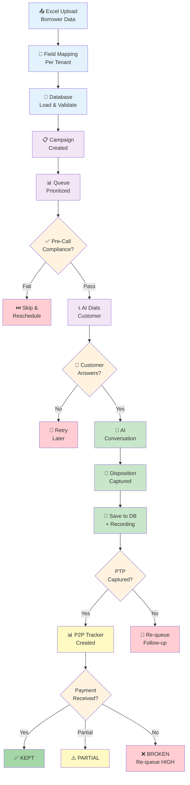

**[Diagram 1: Complete OD Collection Flow — Upload to Promise Tracking]**

---

### 2.1 Data Flow Diagram

#### Level-0: System Context

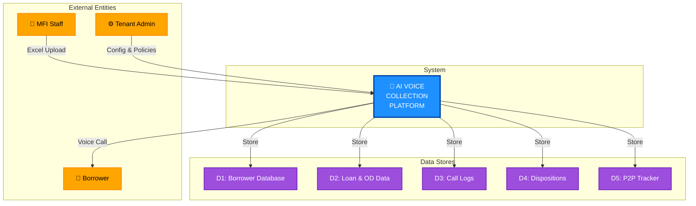

**[Diagram 2: Data Flow Level-0]**

#### 📋 Color Coding

| Color | Element | Meaning |
|-------|---------|---------|
| 🟠 **Orange** | External Entities | MFI Staff, Borrower, Admin |
| 🔵 **Blue** | Core Process | AI Voice Collection Platform |
| 🟣 **Purple** | Data Stores | Databases & trackers |

---

#### Level-1: Detailed Processes

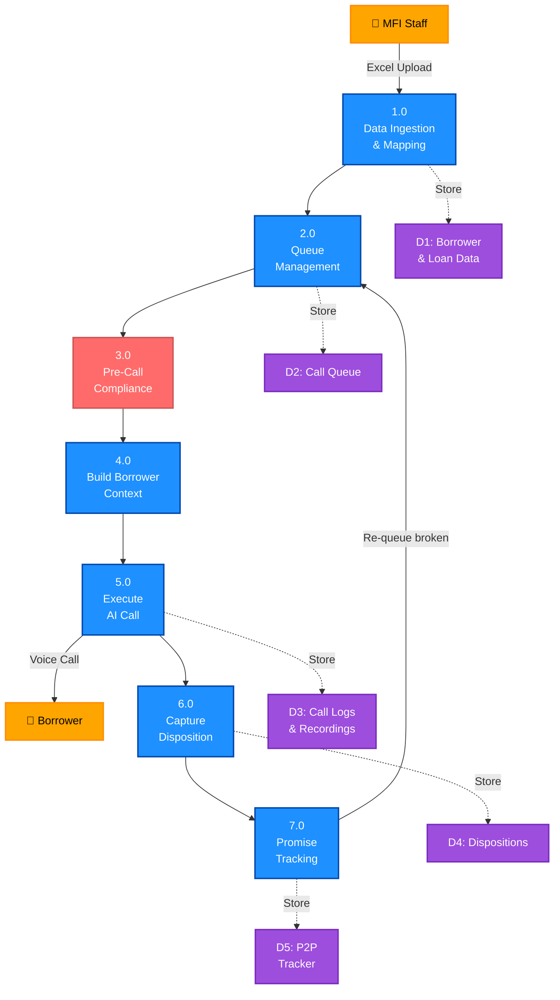

**[Diagram 3: Data Flow Level-1]**

| Color | Element | Meaning |
|-------|---------|---------|
| 🟠 **Orange** | External Entities | MFI Staff, Borrower |
| 🔵 **Blue** | Processes (1.0–7.0) | Main business operations |
| 🔴 **Red** | Process 3.0 | Critical: Compliance check |
| 🟣 **Purple** | Data Stores (D1–D5) | Databases & storage |

---

## 3. 🌐 System Overview

### 3.1 System Overview

The **AI Voice Collection Agent** serves as a **full-duplex AI calling platform** that connects microfinance companies with overdue borrowers through intelligent, context-aware voice conversations.

**Key Platform Features:**
- Full-duplex AI voice agent using LiveKit + Sarvam + Gemini
- 21-state call state machine with JSON-driven reason flows
- Multi-tenant database with per-company field mapping
- DPD-bucket-specific negotiation strategy
- App-level compliance enforcement (not prompt-dependent)
- Promise tracking with automated broken-promise follow-up

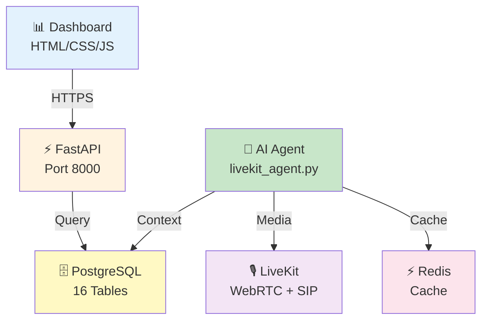

**[Diagram 4: System Architecture Overview]**

### 3.2 🎯 Key Objectives

| Category | Objective | Outcome |
|----------|-----------|---------|
| Business | Replace manual calling with AI | 10x call volume, consistent quality |
| Business | Structured disposition capture | OD reason + P2P in every call |
| Business | Multi-tenant SaaS | Sell to other MFIs/NBFCs |
| Technical | Domain-expert AI (not generic bot) | 7-layer intelligence stack |
| Technical | Provider-agnostic architecture | Switch STT/TTS/LLM via env vars |
| Operational | Automated promise tracking | Broken-promise re-queue |
| Compliance | RBI Fair Practices Code | Hard-coded app-level enforcement |
| Language | Hindi + Bengali + English | Expandable to 10+ Indian languages |

---

## 4. Infrastructure Architecture

### 4.1 Hosting Environment

| Component | Environment | Purpose |
|-----------|-------------|---------|
| FastAPI Backend | Azure VM (Ubuntu) | Core API, telephony routing, dashboard |
| LiveKit Agent | Azure VM | AI voice agent worker process |
| LiveKit Server | Azure VM | WebRTC media server + SIP bridge |
| PostgreSQL | Self-hosted Supabase | 16-table multi-tenant database |
| Redis | Docker container | Context caching (15-min TTL) |
| Qdrant | Docker container | Vector DB for RAG/objection search |
| Nginx | Azure VM | SSL termination + reverse proxy |

### 4.2 🔒 Security & Networking

#### Security Measures
- ✅ HTTPS enforced (TLS 1.2+) with Let's Encrypt SSL
- ✅ Firewall rules restrict access to ports 443, 8000, 7880
- ✅ Row-Level Security (RLS) on all tenant-scoped tables
- ✅ JWT authentication for dashboard users
- ✅ SIP trunk authentication for telephony
- ✅ Call recordings encrypted at rest

### 4.3 📐 Logical Topology

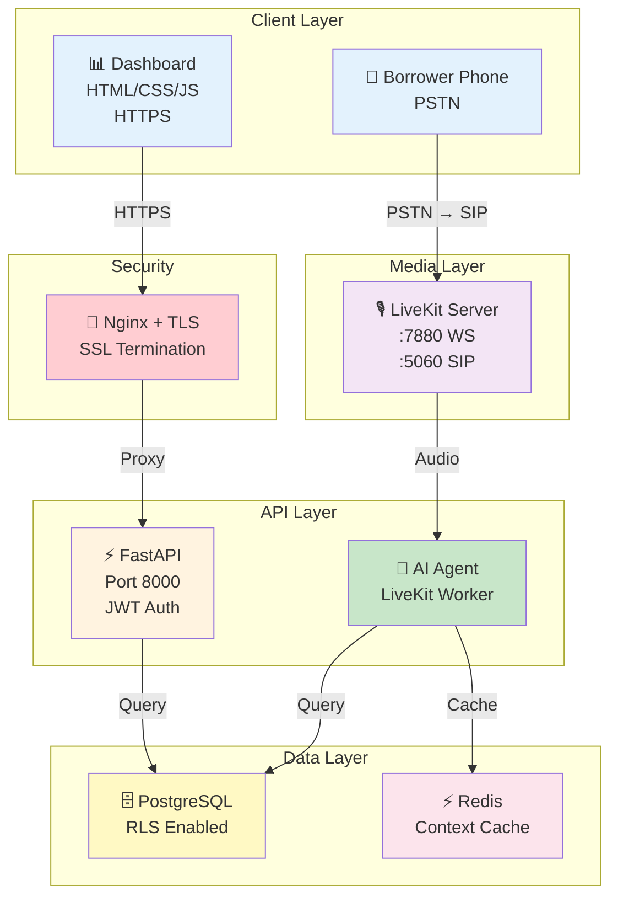

**[Diagram 5: Logical Topology]**

---

## 5. Technology Stack

### 5.1 Stack Components

| Layer | Primary Technology | Why Chosen | Notes |
|-------|-------------------|-----------|-------|
| Frontend | HTML/CSS/JS | Simple, no build steps, fast iteration | Dashboard + login |
| Backend | FastAPI (Python) | Async, Pydantic validation, OpenAPI | Telephony + API + uploads |
| Voice Agent | LiveKit Agents Framework | Production WebRTC, built-in VAD pipeline | Full-duplex voice |
| STT | Sarvam AI (saaras:v3) | Best Indian language accuracy | Hindi/Bengali/English |
| TTS | Sarvam AI (bulbul:v2) | Natural Indian voices | Multi-language |
| VAD | Silero VAD | Lightweight, accurate speech detection | Runs on CPU |
| LLM | Google Gemini 2.0 Flash | Fast, cheap, good multilingual | 300ms response |
| Database | PostgreSQL + Supabase | ACID, JSONB, RLS, pgvector ready | 16 tables |
| Cache | Redis 7 | Context caching, session memory | 15-min TTL |
| Vector DB | Qdrant | RAG search, objection embeddings | Phase 3 |
| Telephony | JIO SIP + Exotel | Dual-mode, runtime switchable | Provider-agnostic |
| Deployment | Docker Compose | Environment parity, easy scaling | Azure VM |
| Reverse Proxy | Nginx | SSL termination, load balancing | Let's Encrypt |

### 5.2 Component-to-Tool Mapping

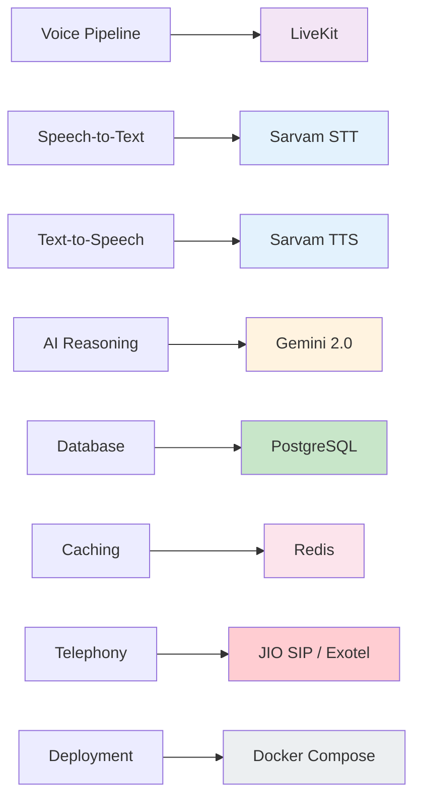

**[Diagram 6: Component-to-Tool Mapping]**

---

## 6. 🧠 7-Layer Intelligence Stack

### 6.1 Architecture Overview

The AI agent's intelligence is built in **7 layers** stacked around the LLM. The LLM provides language capability; everything else is built in Python + JSON.

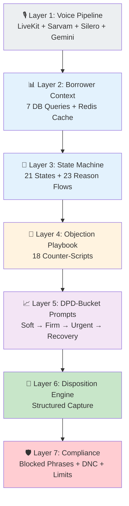

**[Diagram 7: 7-Layer Intelligence Stack]**

### 6.2 Layer Details

| Layer | Purpose | Implementation | Files |
|-------|---------|---------------|-------|
| Layer 1 | Audio I/O + language generation | LiveKit Agents + Sarvam plugins + Gemini | `livekit_agent.py` |
| Layer 2 | Borrower profile, OD, history, risk | 7 parallel async DB queries, Redis cache | `context_builder.py` |
| Layer 3 | Call flow control, reason handling | 21-state machine, JSON reason trees | `state_machine.py`, `reason_flows.json` |
| Layer 4 | Mid-call objection countering | Keyword match → counter-script injection | `objection_playbook.json`, `objection_registry.py` |
| Layer 5 | DPD-based negotiation tone | SMA0=soft, SMA1=firm, SMA2=urgent, NPA=recovery | `prompting.py` |
| Layer 6 | Structured output | PTP capture, willingness, escalation flags | `state_machine.py` (disposition) |
| Layer 7 | Regulatory compliance | Blocked phrases, DNC, time limits, max calls | `compliance_filter.py` |

---

## 7. Architecture Design

### 7.1 🧩 Components

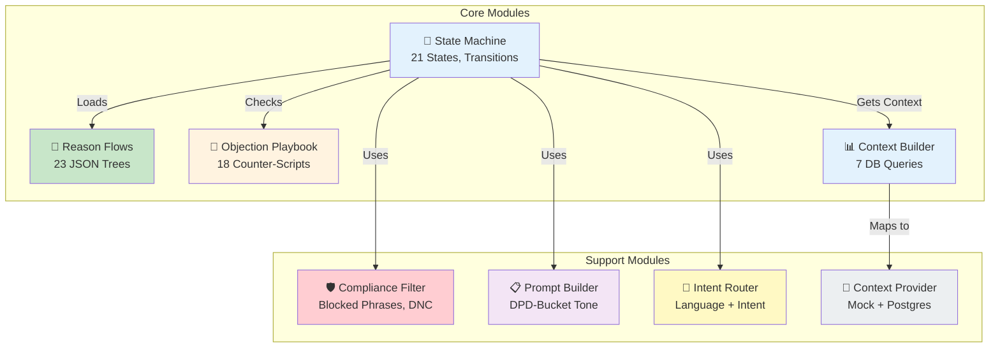

**[Diagram 8: Core Module Architecture]**

### 7.2 🔄 Component Interactions

| Step | Interaction |
|------|-------------|
| Step 1 | Queue picks next call → Compliance pre-check (time, DNC, limits) |
| Step 2 | Context builder runs 7 parallel DB queries → builds 50+ field context |
| Step 3 | State machine initializes with context → loads reason_flows.json + objection_playbook.json |
| Step 4 | AI greets borrower → state = GREETING → customer responds |
| Step 5 | Intent router classifies response → state machine transitions |
| Step 6 | If reason detected → JSON reason flow drives conversation steps |
| Step 7 | If objection detected → counter-script injected into LLM prompt |
| Step 8 | Compliance filter checks every AI response before TTS |
| Step 9 | Disposition captured → saved to DB → P2P tracker auto-created |

### 7.3 📊 Sequence Diagram (Happy Path: Borrower Answers)

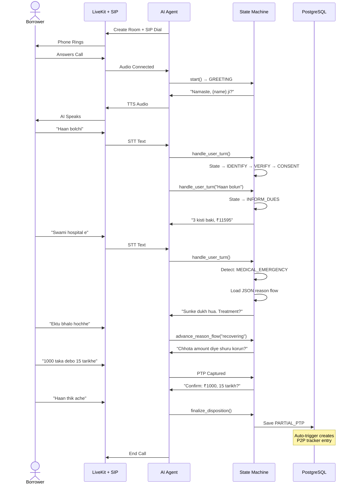

**[Diagram 9: Complete Happy Path — Borrower Answers, Medical Reason, PTP Captured]**

---

## 8. Module Descriptions

### 📞 8.1 Call Orchestrator

**What it does:**
Main loop — picks calls from queue, checks compliance, builds context, dials customer, runs conversation, saves disposition.

**Key Flows:**
1. CampaignRunner continuously picks from call_queue (SELECT FOR UPDATE SKIP LOCKED)
2. CompliancePreCheck validates time window, DNC, max calls, cool-off
3. ContextBuilder runs 7 parallel DB queries, caches in Redis
4. LiveKit room created, SIP dial initiated
5. Conversation loop runs until disposition captured

**Concurrency:** asyncio.Semaphore(5) — max 5 simultaneous calls per worker

---

### 🔄 8.2 State Machine (21 States)

**What it does:**
Controls the entire call flow — from greeting to disposition. Every state has specific instructions for the LLM.

**States:**

| Category | States | Count |
|----------|--------|-------|
| Opening | GREETING, IDENTIFY_RECEIVER, VERIFY_RIGHT_PARTY, CONSENT | 4 |
| Third Party | THIRD_PARTY_MESSAGE, THIRD_PARTY_LOCATE, THIRD_PARTY_CALLBACK | 3 |
| Collection | INFORM_DUES, REASON_PROBE, HANDLE_REASON | 3 |
| Negotiation | NEGOTIATE, OFFER_PARTIAL, COMMITMENT_CAPTURE, RECAP | 4 |
| Special | ALREADY_PAID_VERIFY, DISPUTE_HANDLE, INSURANCE_CLAIM, ESCALATE, DNC_ACKNOWLEDGE | 5 |
| Closing | CLOSE | 1 |
| **Total** | | **21** |

---

### 🌳 8.3 Reason Flow Engine

**What it does:**
JSON-driven conversation trees for 23 OD reasons. When AI detects a reason (e.g., "husband hospital e"), it loads the matching multi-step flow from `reason_flows.json`.

**Key Flows:**
1. Customer gives reason → intent_router classifies into 23 categories
2. reason_registry loads matching JSON flow → returns ReasonFlow object
3. State machine enters HANDLE_REASON → follows JSON steps
4. Each step has: agent_action, expected_responses, next_step_map
5. Flow exits to NEGOTIATE or CLOSE when complete

**All 23 Reasons:**

| Category | Reasons |
|----------|---------|
| Death / Medical | BORROWER_DECEASED, SPOUSE_DECEASED, MEDICAL_EMERGENCY, MENTAL_HEALTH |
| Income Loss | NO_INCOME, JOB_LOSS, BUSINESS_LOSS, SALARY_DELAYED, AGRICULTURAL_LOSS |
| Relationship | LOAN_GIVEN_TO_OTHER, DIVORCE_SEPARATION, DOMESTIC_VIOLENCE, GROUP_LEADER_ISSUE |
| Dispute | DISPUTE_AMOUNT, DISPUTE_SERVICE, ALREADY_PAID |
| Behavioral | FORGOT, WILLFUL_DEFAULT, BORROWER_ABSCONDED, BORROWER_MIGRATED |
| External | NATURAL_DISASTER, FAMILY_PROBLEM, OTHER |

---

### 🎯 8.4 Objection Playbook

**What it does:**
Detects mid-call pushback during negotiation (e.g., "paisa nahi hai") and injects tested counter-scripts into the LLM prompt.

**18 Objections:**

| Category | Objections | Strategy Example |
|----------|-----------|-----------------|
| 💰 Money (4) | CANT_PAY_ANYTHING, SARCASTIC_SMALL_AMOUNT, WILL_CLOSE_FULL_LATER, OTHER_LOANS_PRIORITY | Accept ₹200 and upsell |
| 🏃 Avoidance (4) | WILL_PAY_LATER_VAGUE, BUSY_RIGHT_NOW, BORROWER_NOT_HOME, PHONE_NOT_MINE | Pin down exact date |
| 😠 Hostile (3) | DO_WHATEVER_YOU_WANT, THREATENING_LEGAL, ASK_FOR_SUPERVISOR | Stay calm, state consequences |
| 📋 Claims (4) | ALREADY_PAID_CLAIM, AMOUNT_IS_WRONG, LOAN_NOT_FOR_ME, BLAMING_COMPANY | Verify details, separate issues |
| ❤️ Sensitive (3) | STAFF_COMPLAINT, EMOTIONAL_BREAKDOWN, DECEASED_FAMILY | Stop payment talk, empathize |

---

### 🛡️ 8.5 Compliance Engine

**What it does:**
Hard-coded guardrails enforced at app layer — the LLM cannot bypass these.

| Check | When | How |
|-------|------|-----|
| Time window (8AM–7PM) | Pre-call | `TenantPolicy.within_call_window()` |
| DNC flag | Pre-call | `clients.dnc_flag` check |
| Max 3 calls/day | Pre-call | COUNT from call_logs today |
| 30-min cool-off | Pre-call | Last call_end comparison |
| Blocked phrases | Every AI response | `ComplianceFilter.filter()` before TTS |
| DNC keywords | Every customer turn | `is_dnc_request()` hard-coded |
| No OD to third party | State-level | THIRD_PARTY_MESSAGE instructions |
| Banking day enforcement | PTP capture | `TenantPolicy.next_working_day()` |

---

### 📊 8.6 Analytics & Dashboard

**Dashboards:**
- Call volume by campaign, date, agent
- Disposition distribution (PTP / PARTIAL / REFUSED / CALLBACK)
- P2P promise tracking (KEPT / BROKEN / PENDING)
- OD reason distribution across portfolio
- DPD bucket migration tracking
- Average call duration and turns per disposition
- Objection frequency by category

**Built with:** HTML/CSS/JS + FastAPI REST endpoints + read-only SQL views

---

## 9. Data Design

### 9.1 Database Schema (16 Tables)

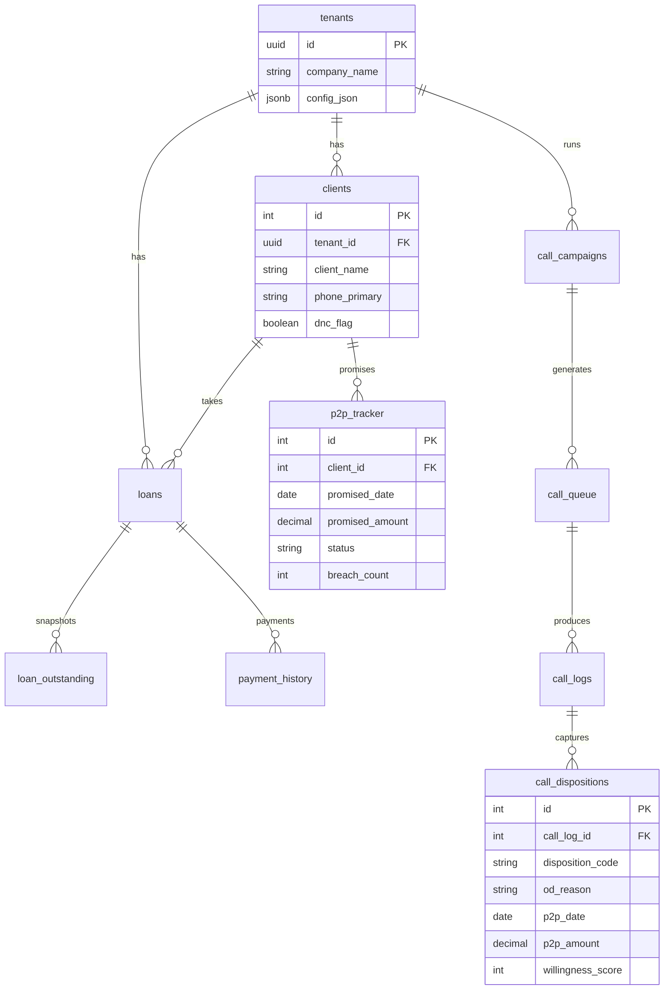

**[Diagram 10: Database ER Diagram]**

### 9.2 Key Tables

| Table | Purpose | Key Fields |
|-------|---------|-----------|
| tenants | Multi-tenant company config | id, company_name, config_json |
| clients | Borrower master data | client_name, phone, dnc_flag, preferred_language |
| loans | Loan details | loan_amount, emi_amount, total_installments |
| loan_outstanding | OD snapshot (latest per loan) | total_od, days_past_due, od_bucket |
| payment_history | All payments received | payment_date, amount, mode |
| call_campaigns | Batch campaign definition | campaign_name, start_date, status |
| call_queue | Individual call items | client_id, priority, status, attempt_count |
| call_logs | Call execution records | call_start, duration, transcript_json |
| call_dispositions | Structured call outcomes | disposition_code, od_reason, p2p_date, p2p_amount |
| p2p_tracker | Promise monitoring | promised_date, status (KEPT/BROKEN/PARTIAL) |
| tenant_config | Per-tenant OD buckets, dispositions | config_type, config_data |
| field_mappings | Excel column mapping per tenant | standard_field, tenant_column_name |
| org_units | Branch/center hierarchy (self-referencing) | unit_name, parent_id |
| officers | Field officer directory | officer_name, contact_no |
| users | System users with roles | username, role, branch_access |
| upload_logs | Excel upload audit trail | filename, row_count, status |

---

## 10. Deployment Architecture

### 10.1 Docker Compose Services

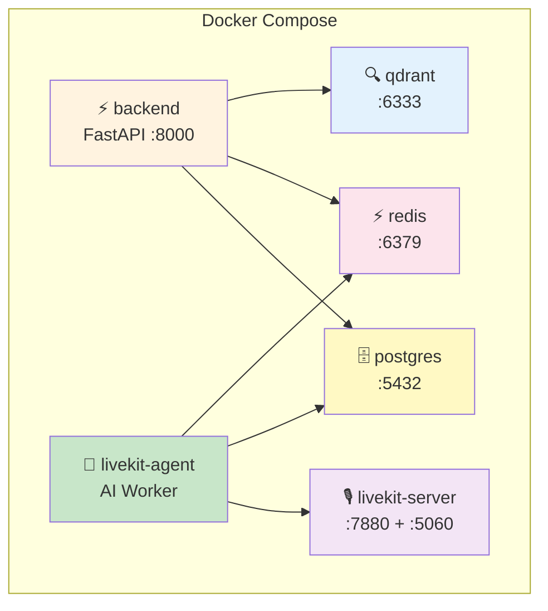

**[Diagram 11: Docker Compose Services]**

### 10.2 External API Dependencies

| Service | Purpose | Fallback |
|---------|---------|----------|
| Sarvam AI | STT + TTS for Indian languages | Deepgram / Azure Speech |
| Google Gemini | LLM response generation | GPT-4o / Claude |
| JIO SIP | Primary telephony trunk | Exotel |
| Exotel | Secondary telephony | Twilio (future) |

---

## 11. Compliance & Regulatory

### 11.1 RBI Fair Practices Code Mapping

| RBI Requirement | Implementation | Status |
|----------------|---------------|--------|
| No calls outside 8AM–7PM | `TenantPolicy.within_call_window()` | ✅ |
| No abusive/threatening language | `ComplianceFilter.BLOCKED_PHRASES` | ✅ |
| Respect DNC requests | `is_dnc_request()` hard-coded detection | ✅ |
| No third-party disclosure | State: THIRD_PARTY_MESSAGE — no OD mention | ✅ |
| No threats of legal action | Blocked: "police", "jail", "court bhejenge" | ✅ |
| Maintain call records | CallMediaRecorder + transcript_json | ✅ |
| Borrower identity verification | State: VERIFY_RIGHT_PARTY before OD inform | ✅ |

### 11.2 Data Retention

| Data Type | Retention | Storage |
|-----------|----------|---------|
| Call recordings | 12 months | Blob Storage |
| Call transcripts | 24 months | PostgreSQL |
| Dispositions | 36 months | PostgreSQL |
| P2P tracker | 36 months | PostgreSQL |
| Audit logs | 36 months | PostgreSQL |

---

## 12. Risks & Mitigations

| Risk | Impact | Probability | Mitigation |
|------|--------|------------|------------|
| Sarvam STT accuracy in noisy calls | Low transcription quality | Medium | Fallback to Deepgram; filler filter in `intent_router.py` |
| LLM generates non-compliant response | Regulatory violation | Low | `ComplianceFilter` runs on EVERY response before TTS |
| Customer uses unseen objection phrasing | Objection missed | Medium | Phase 2: pgvector semantic matching; Phase 3: fine-tuned classifier |
| SIP trunk downtime | Calls can't be placed | Low | Dual-mode telephony (JIO SIP + Exotel runtime switch) |
| Database overload during batch calling | Slow context building | Low | Redis cache (15-min TTL); asyncio.gather for parallel queries |
| Borrower death reported incorrectly | Inappropriate payment push | Medium | DECEASED_REPORT → INSURANCE_CLAIM state; no payment discussion |
| Broken promise rate high | Low recovery | Medium | Automated re-queue with HIGH priority; DPD-tone escalation |

---

## 13. Success Metrics & KPIs

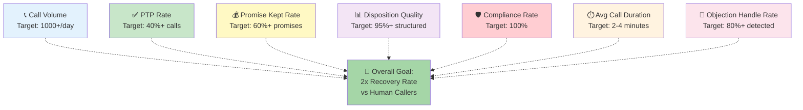

**[Diagram 12: KPI Dashboard]**

### ✅ Transparency & Auditability
All calls recorded with transcripts, dispositions, and state transitions logged for complete audit trail.

### ✅ Compliance Readiness
100% adherence to RBI Fair Practices Code with hard-coded app-level enforcement, not prompt-dependent.

---

## 14. 🔄 AI Call Execution Flow

### 14.1 🛠️ Pre-requisites

#### 📞 Telephony Setup
- JIO SIP trunk configured with LiveKit SIP bridge
- Exotel account as backup telephony provider
- SIP trunk IDs stored in `.env`

#### 📊 Data Setup
- Excel uploaded with borrower + loan + outstanding data
- Field mapping configured per tenant
- Campaign created with call queue populated

### 14.2 🤖 Call Execution — Single Turn Flow

| Step | Action |
|------|--------|
| 1. Audio Capture | Customer speaks → LiveKit captures audio frames |
| 2. VAD Detection | Silero VAD detects speech end (0.8s silence) |
| 3. STT Transcription | Sarvam STT converts audio → text |
| 4. DNC Check | Hard-coded keyword scan for "stop calling" |
| 5. Objection Scan | Keyword match against 18 objection trigger phrases |
| 6. State Instruction | State machine provides current state guidance |
| 7. Prompt Assembly | 6-section prompt built (~4000 chars) |
| 8. LLM Generation | Gemini generates response (SPEAK + META format) |
| 9. Response Parsing | Split speech text from metadata JSON |
| 10. Compliance Filter | Blocked phrase check before TTS |
| 11. State Update | Metadata routed to state machine methods |
| 12. TTS Synthesis | Sarvam TTS converts text → audio |
| 13. Audio Publish | LiveKit → SIP → PSTN → customer hears |

### 14.3 📊 Complete Call Timeline

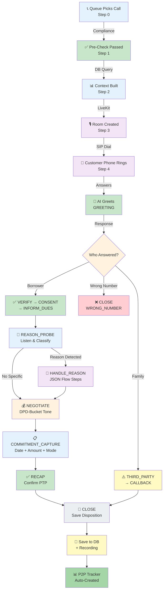

**[Diagram 13: Complete AI Call Timeline — Queue to P2P Tracker]**

---

## Appendix: Complete File Architecture

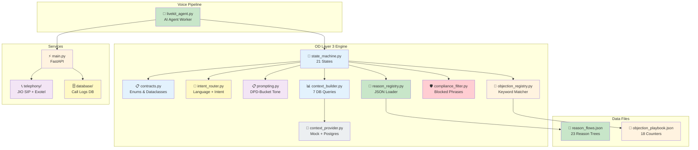

**[Diagram 14: Complete File Architecture]**

---

**Document End**

**Generated:** 2026-03-17
**Version:** 3.0
**Format:** Markdown with Mermaid Diagrams (GitHub-Compatible)

**Key Features in v3.0:**
✅ 21-state call state machine with JSON-driven reason flows
✅ 23 OD reason conversation trees (no code changes to add new reasons)
✅ 18 objection counter-scripts with keyword matching
✅ DPD-bucket-specific negotiation tone (soft → urgent → recovery)
✅ App-level compliance engine (blocked phrases, DNC, time limits)
✅ Multi-tenant database with RLS and configurable OD buckets
✅ Provider-agnostic architecture (switchable STT/TTS/LLM/telephony)
✅ Automated P2P tracker with broken-promise re-queuing
✅ Full call recording + transcript logging + structured dispositions
✅ Dual telephony mode (JIO SIP + Exotel) with runtime switching
