# 🏗️ High-Level Design Document

## Universal AI Microfinance OD Collection Calling Platform

> **Version 2.0** | **Last Updated:** March 2026
>
> Full-duplex AI voice agent for overdue loan collection — replacing human callers
> with a domain-expert AI that negotiates, empathizes, and captures structured dispositions.

---

## 📋 Table of Contents

1. [Project Vision](#1--project-vision)
2. [System Context Diagram](#2--system-context-diagram)
3. [High-Level Architecture](#3--high-level-architecture)
4. [7-Layer Intelligence Stack](#4--7-layer-intelligence-stack)
5. [Component Architecture](#5--component-architecture)
6. [Data Flow Diagrams](#6--data-flow-diagrams)
7. [Process Flows](#7--process-flows)
8. [Call State Machine](#8--call-state-machine)
9. [Reason Flow Engine](#9--reason-flow-engine)
10. [Objection Handling Pipeline](#10--objection-handling-pipeline)
11. [Prompt Engineering Architecture](#11--prompt-engineering-architecture)
12. [Data Architecture](#12--data-architecture)
13. [Deployment Architecture](#13--deployment-architecture)
14. [Security and Compliance](#14--security-and-compliance)
15. [Integration Points](#15--integration-points)
16. [Scalability Design](#16--scalability-design)
17. [Technology Stack](#17--technology-stack)

---

## 1. 🎯 Project Vision

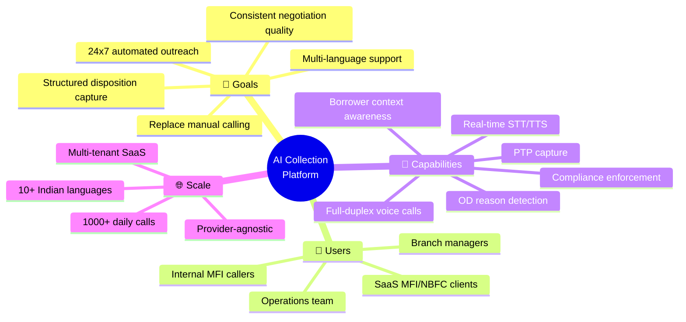
```mermaid
mindmap
  root((AI Collection<br/>Platform))
    🎯 Goals
      Replace manual calling
      24x7 automated outreach
      Consistent negotiation quality
      Structured disposition capture
      Multi-language support
    👥 Users
      Internal MFI callers
      Branch managers
      Operations team
      SaaS MFI/NBFC clients
    🔧 Capabilities
      Full-duplex voice calls
      Real-time STT/TTS
      Borrower context awareness
      OD reason detection
      PTP capture
      Compliance enforcement
    🌐 Scale
      1000+ daily calls
      10+ Indian languages
      Multi-tenant SaaS
      Provider-agnostic
```

### Business Context

The platform operates in a cycle: **Upload → Enrich → Call → Negotiate → Capture → Track → Follow-up → Repeat**

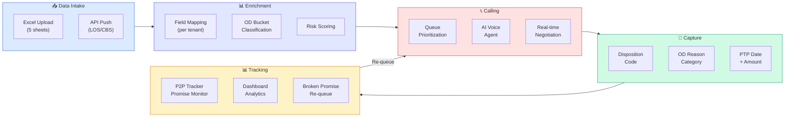
```mermaid
graph LR
    subgraph INTAKE["📥 Data Intake"]
        A1["Excel Upload<br/>(5 sheets)"]
        A2["API Push<br/>(LOS/CBS)"]
    end

    subgraph ENRICH["📊 Enrichment"]
        B1["Field Mapping<br/>(per tenant)"]
        B2["OD Bucket<br/>Classification"]
        B3["Risk Scoring"]
    end

    subgraph CALL["📞 Calling"]
        C1["Queue<br/>Prioritization"]
        C2["AI Voice<br/>Agent"]
        C3["Real-time<br/>Negotiation"]
    end

    subgraph CAPTURE["📝 Capture"]
        D1["Disposition<br/>Code"]
        D2["OD Reason<br/>Category"]
        D3["PTP Date<br/>+ Amount"]
    end

    subgraph TRACK["📊 Tracking"]
        E1["P2P Tracker<br/>Promise Monitor"]
        E2["Dashboard<br/>Analytics"]
        E3["Broken Promise<br/>Re-queue"]
    end

    INTAKE --> ENRICH --> CALL --> CAPTURE --> TRACK
    TRACK -->|"Re-queue"| CALL

    style INTAKE fill:#dbeafe,stroke:#2563eb
    style ENRICH fill:#e0e7ff,stroke:#4f46e5
    style CALL fill:#fee2e2,stroke:#dc2626
    style CAPTURE fill:#d1fae5,stroke:#059669
    style TRACK fill:#fef3c7,stroke:#d97706
```

---

## 2. 🌐 System Context Diagram

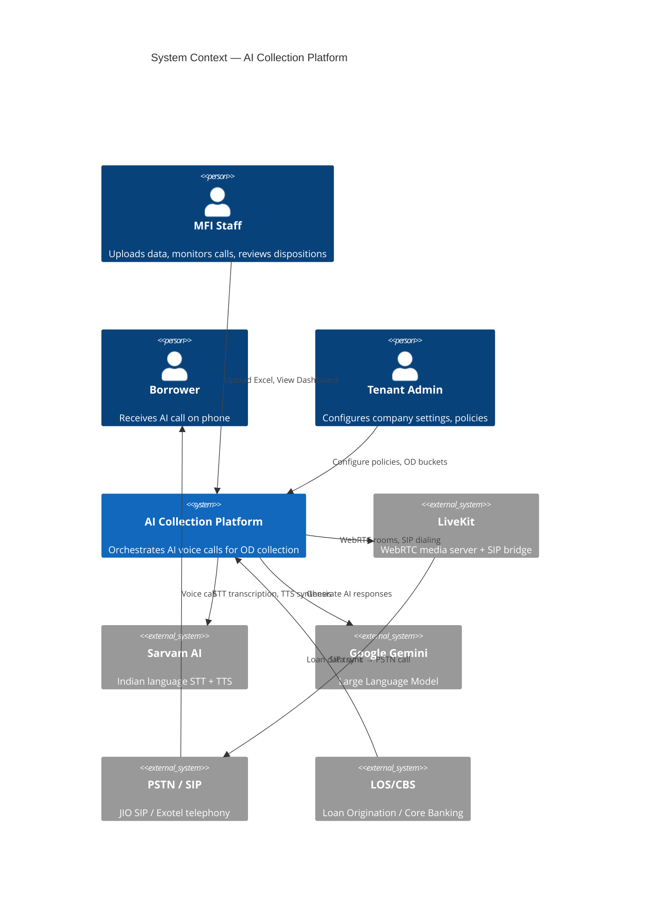
```mermaid
C4Context
    title System Context — AI Collection Platform

    Person(mfi_user, "MFI Staff", "Uploads data, monitors calls, reviews dispositions")
    Person(borrower, "Borrower", "Receives AI call on phone")
    Person(admin, "Tenant Admin", "Configures company settings, policies")

    System(platform, "AI Collection Platform", "Orchestrates AI voice calls for OD collection")

    System_Ext(livekit, "LiveKit", "WebRTC media server + SIP bridge")
    System_Ext(sarvam, "Sarvam AI", "Indian language STT + TTS")
    System_Ext(gemini, "Google Gemini", "Large Language Model")
    System_Ext(pstn, "PSTN / SIP", "JIO SIP / Exotel telephony")
    System_Ext(los, "LOS/CBS", "Loan Origination / Core Banking")

    Rel(mfi_user, platform, "Upload Excel, View Dashboard")
    Rel(admin, platform, "Configure policies, OD buckets")
    Rel(platform, livekit, "WebRTC rooms, SIP dialing")
    Rel(platform, sarvam, "STT transcription, TTS synthesis")
    Rel(platform, gemini, "Generate AI responses")
    Rel(livekit, pstn, "SIP trunk → PSTN call")
    Rel(pstn, borrower, "Voice call")
    Rel(los, platform, "Loan data sync")
```

---

## 3. 🏗️ High-Level Architecture

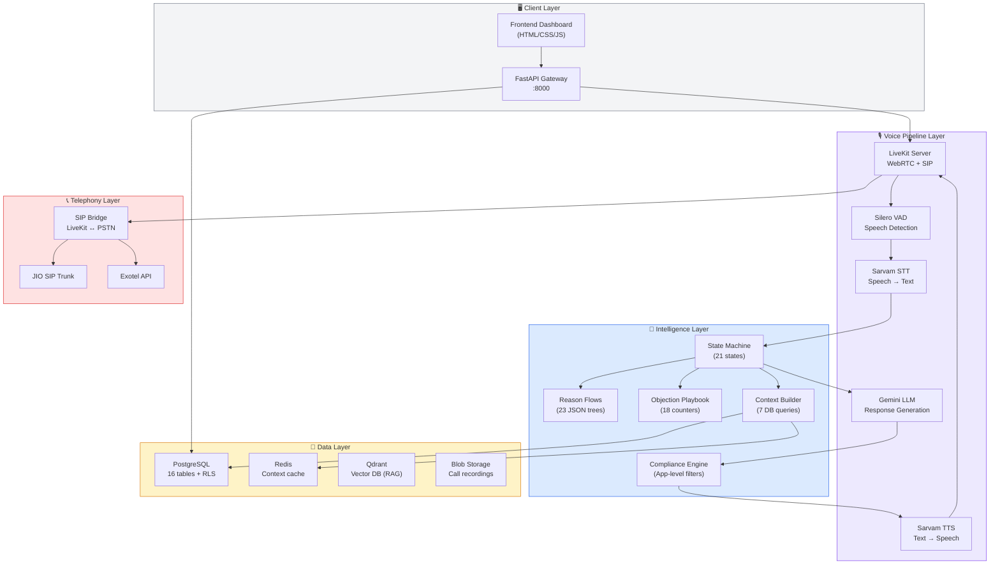
```mermaid
graph TB
    subgraph CLIENT["🖥️ Client Layer"]
        FE["Frontend Dashboard<br/>(HTML/CSS/JS)"]
        API_GW["FastAPI Gateway<br/>:8000"]
    end

    subgraph VOICE["🎙️ Voice Pipeline Layer"]
        LK["LiveKit Server<br/>WebRTC + SIP"]
        VAD["Silero VAD<br/>Speech Detection"]
        STT["Sarvam STT<br/>Speech → Text"]
        TTS["Sarvam TTS<br/>Text → Speech"]
        LLM["Gemini LLM<br/>Response Generation"]
    end

    subgraph INTELLIGENCE["🧠 Intelligence Layer"]
        SM["State Machine<br/>(21 states)"]
        RF["Reason Flows<br/>(23 JSON trees)"]
        OBJ["Objection Playbook<br/>(18 counters)"]
        CTX["Context Builder<br/>(7 DB queries)"]
        COMP["Compliance Engine<br/>(App-level filters)"]
    end

    subgraph DATA["💾 Data Layer"]
        PG["PostgreSQL<br/>16 tables + RLS"]
        RD["Redis<br/>Context cache"]
        QD["Qdrant<br/>Vector DB (RAG)"]
        BLOB["Blob Storage<br/>Call recordings"]
    end

    subgraph TELEPHONY["📞 Telephony Layer"]
        SIP_B["SIP Bridge<br/>LiveKit ↔ PSTN"]
        JIO["JIO SIP Trunk"]
        EXO["Exotel API"]
    end

    FE --> API_GW
    API_GW --> LK
    API_GW --> PG

    LK --> VAD --> STT
    STT --> SM
    SM --> RF
    SM --> OBJ
    SM --> LLM
    LLM --> COMP --> TTS --> LK

    CTX --> PG
    CTX --> RD
    SM --> CTX

    LK --> SIP_B
    SIP_B --> JIO
    SIP_B --> EXO

    style CLIENT fill:#f3f4f6,stroke:#6b7280
    style VOICE fill:#ede9fe,stroke:#7c3aed
    style INTELLIGENCE fill:#dbeafe,stroke:#2563eb
    style DATA fill:#fef3c7,stroke:#d97706
    style TELEPHONY fill:#fee2e2,stroke:#dc2626
```

---

## 4. 🧠 7-Layer Intelligence Stack

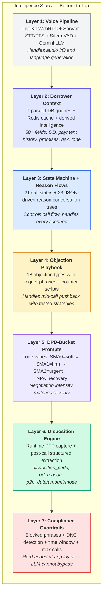
```mermaid
graph TB
    subgraph STACK["Intelligence Stack — Bottom to Top"]
        direction TB
        L1["<b>Layer 1: Voice Pipeline</b><br/>LiveKit WebRTC + Sarvam STT/TTS + Silero VAD + Gemini LLM<br/><i>Handles audio I/O and language generation</i>"]
        L2["<b>Layer 2: Borrower Context</b><br/>7 parallel DB queries + Redis cache + derived intelligence<br/><i>50+ fields: OD, payment history, promises, risk, tone</i>"]
        L3["<b>Layer 3: State Machine + Reason Flows</b><br/>21 call states + 23 JSON-driven reason conversation trees<br/><i>Controls call flow, handles every scenario</i>"]
        L4["<b>Layer 4: Objection Playbook</b><br/>18 objection types with trigger phrases + counter-scripts<br/><i>Handles mid-call pushback with tested strategies</i>"]
        L5["<b>Layer 5: DPD-Bucket Prompts</b><br/>Tone varies: SMA0=soft → SMA1=firm → SMA2=urgent → NPA=recovery<br/><i>Negotiation intensity matches severity</i>"]
        L6["<b>Layer 6: Disposition Engine</b><br/>Runtime PTP capture + post-call structured extraction<br/><i>disposition_code, od_reason, p2p_date/amount/mode</i>"]
        L7["<b>Layer 7: Compliance Guardrails</b><br/>Blocked phrases + DNC detection + time window + max calls<br/><i>Hard-coded at app layer — LLM cannot bypass</i>"]

        L1 --> L2 --> L3 --> L4 --> L5 --> L6 --> L7
    end

    style L1 fill:#f3f4f6,stroke:#6b7280
    style L2 fill:#e0e7ff,stroke:#4f46e5
    style L3 fill:#dbeafe,stroke:#2563eb
    style L4 fill:#fef3c7,stroke:#d97706
    style L5 fill:#ede9fe,stroke:#7c3aed
    style L6 fill:#d1fae5,stroke:#059669
    style L7 fill:#fee2e2,stroke:#dc2626
```

### Key Principle

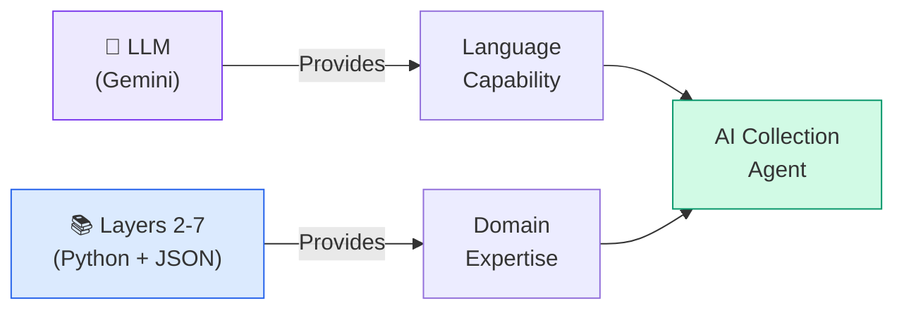
```mermaid
graph LR
    LLM["🤖 LLM<br/>(Gemini)"] -->|"Provides"| LANG["Language<br/>Capability"]
    LAYERS["📚 Layers 2-7<br/>(Python + JSON)"] -->|"Provides"| DOMAIN["Domain<br/>Expertise"]

    LANG --> AGENT["AI Collection<br/>Agent"]
    DOMAIN --> AGENT

    style LLM fill:#ede9fe,stroke:#7c3aed
    style LAYERS fill:#dbeafe,stroke:#2563eb
    style AGENT fill:#d1fae5,stroke:#059669
```

> **Domain expertise lives in the knowledge and logic layers, NOT in the LLM itself.** The LLM provides language capability. Everything else — context, state logic, negotiation strategy, objection handling, compliance — is built in Python and JSON around it.

---

## 5. 🔧 Component Architecture

### File Dependency Map

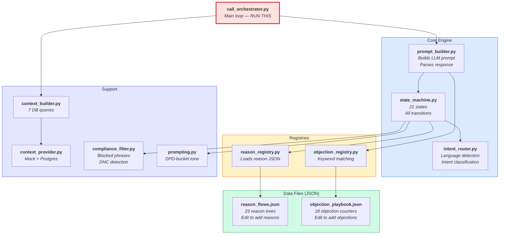
```mermaid
graph TD
    ORCH["<b>call_orchestrator.py</b><br/><i>Main loop — RUN THIS</i>"]

    subgraph CORE["Core Engine"]
        PB["<b>prompt_builder.py</b><br/><i>Builds LLM prompt<br/>Parses response</i>"]
        SM["<b>state_machine.py</b><br/><i>21 states<br/>All transitions</i>"]
        IR["<b>intent_router.py</b><br/><i>Language detection<br/>Intent classification</i>"]
    end

    subgraph DATA_FILES["Data Files (JSON)"]
        RF["<b>reason_flows.json</b><br/><i>23 reason trees<br/>Edit to add reasons</i>"]
        OP["<b>objection_playbook.json</b><br/><i>18 objection counters<br/>Edit to add objections</i>"]
    end

    subgraph LOADERS["Registries"]
        RR["<b>reason_registry.py</b><br/><i>Loads reason JSON</i>"]
        OR["<b>objection_registry.py</b><br/><i>Keyword matching</i>"]
    end

    subgraph SUPPORT["Support"]
        CTX["<b>context_builder.py</b><br/><i>7 DB queries</i>"]
        CP["<b>context_provider.py</b><br/><i>Mock + Postgres</i>"]
        CF["<b>compliance_filter.py</b><br/><i>Blocked phrases<br/>DNC detection</i>"]
        PR["<b>prompting.py</b><br/><i>DPD-bucket tone</i>"]
    end

    ORCH --> CTX
    ORCH --> PB
    PB --> SM
    PB --> OR
    SM --> RR
    SM --> IR
    SM --> CF
    SM --> PR
    RR --> RF
    OR --> OP
    CTX --> CP

    style ORCH fill:#fee2e2,stroke:#dc2626,stroke-width:3px
    style CORE fill:#dbeafe,stroke:#2563eb
    style DATA_FILES fill:#d1fae5,stroke:#059669
    style LOADERS fill:#fef3c7,stroke:#d97706
    style SUPPORT fill:#e0e7ff,stroke:#4f46e5
```

### Component Interaction Sequence

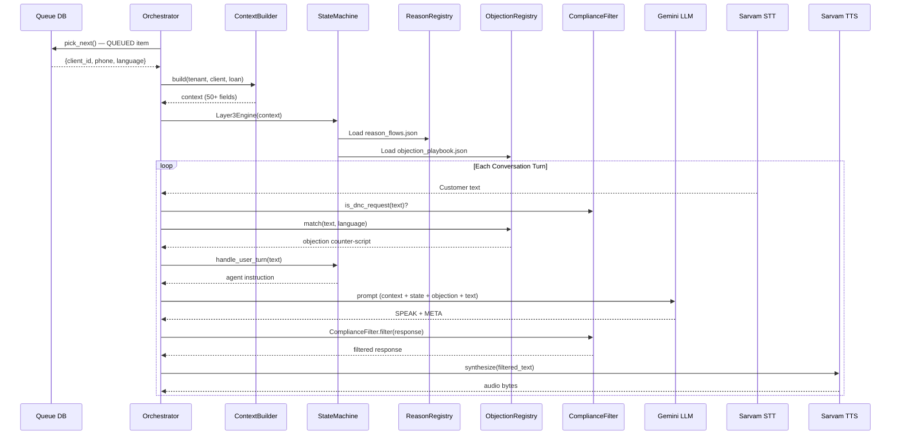
```mermaid
sequenceDiagram
    participant Q as Queue DB
    participant O as Orchestrator
    participant CTX as ContextBuilder
    participant SM as StateMachine
    participant RR as ReasonRegistry
    participant OR as ObjectionRegistry
    participant CF as ComplianceFilter
    participant LLM as Gemini LLM
    participant STT as Sarvam STT
    participant TTS as Sarvam TTS

    O->>Q: pick_next() — QUEUED item
    Q-->>O: {client_id, phone, language}
    O->>CTX: build(tenant, client, loan)
    CTX-->>O: context (50+ fields)
    O->>SM: Layer3Engine(context)
    SM->>RR: Load reason_flows.json
    SM->>OR: Load objection_playbook.json

    loop Each Conversation Turn
        STT-->>O: Customer text
        O->>CF: is_dnc_request(text)?
        O->>OR: match(text, language)
        OR-->>O: objection counter-script
        O->>SM: handle_user_turn(text)
        SM-->>O: agent instruction
        O->>LLM: prompt (context + state + objection + text)
        LLM-->>O: SPEAK + META
        O->>CF: ComplianceFilter.filter(response)
        CF-->>O: filtered response
        O->>TTS: synthesize(filtered_text)
        TTS-->>O: audio bytes
    end
```

---

## 6. 📊 Data Flow Diagrams

### Level 0: Context Diagram

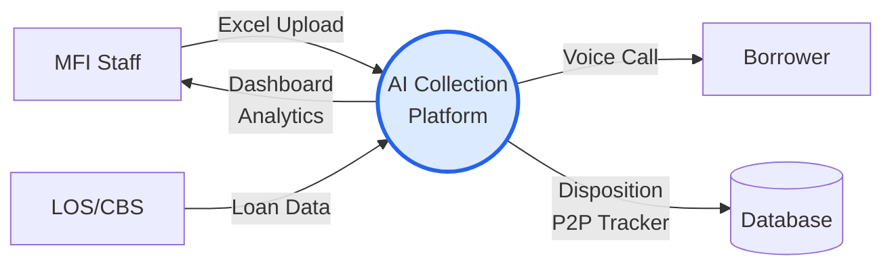
```mermaid
graph LR
    MFI["MFI Staff"] -->|"Excel Upload"| SYS(("AI Collection<br/>Platform"))
    LOS["LOS/CBS"] -->|"Loan Data"| SYS
    SYS -->|"Voice Call"| BORR["Borrower"]
    SYS -->|"Dashboard<br/>Analytics"| MFI
    SYS -->|"Disposition<br/>P2P Tracker"| DB[("Database")]

    style SYS fill:#dbeafe,stroke:#2563eb,stroke-width:3px
```

### Level 1: Major Processes

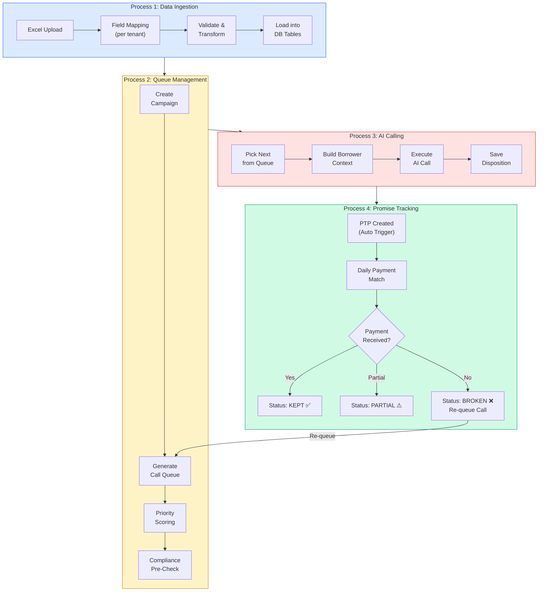
```mermaid
graph TB
    subgraph P1["Process 1: Data Ingestion"]
        P1A["Excel Upload"] --> P1B["Field Mapping<br/>(per tenant)"]
        P1B --> P1C["Validate &<br/>Transform"]
        P1C --> P1D["Load into<br/>DB Tables"]
    end

    subgraph P2["Process 2: Queue Management"]
        P2A["Create<br/>Campaign"] --> P2B["Generate<br/>Call Queue"]
        P2B --> P2C["Priority<br/>Scoring"]
        P2C --> P2D["Compliance<br/>Pre-Check"]
    end

    subgraph P3["Process 3: AI Calling"]
        P3A["Pick Next<br/>from Queue"] --> P3B["Build Borrower<br/>Context"]
        P3B --> P3C["Execute<br/>AI Call"]
        P3C --> P3D["Save<br/>Disposition"]
    end

    subgraph P4["Process 4: Promise Tracking"]
        P4A["PTP Created<br/>(Auto Trigger)"] --> P4B["Daily Payment<br/>Match"]
        P4B --> P4C{"Payment<br/>Received?"}
        P4C -->|"Yes"| P4D["Status: KEPT ✅"]
        P4C -->|"Partial"| P4E["Status: PARTIAL ⚠️"]
        P4C -->|"No"| P4F["Status: BROKEN ❌<br/>Re-queue Call"]
    end

    P1 --> P2 --> P3 --> P4
    P4F -->|"Re-queue"| P2B

    style P1 fill:#dbeafe,stroke:#2563eb
    style P2 fill:#fef3c7,stroke:#d97706
    style P3 fill:#fee2e2,stroke:#dc2626
    style P4 fill:#d1fae5,stroke:#059669
```

### Level 2: AI Call Internal Data Flow

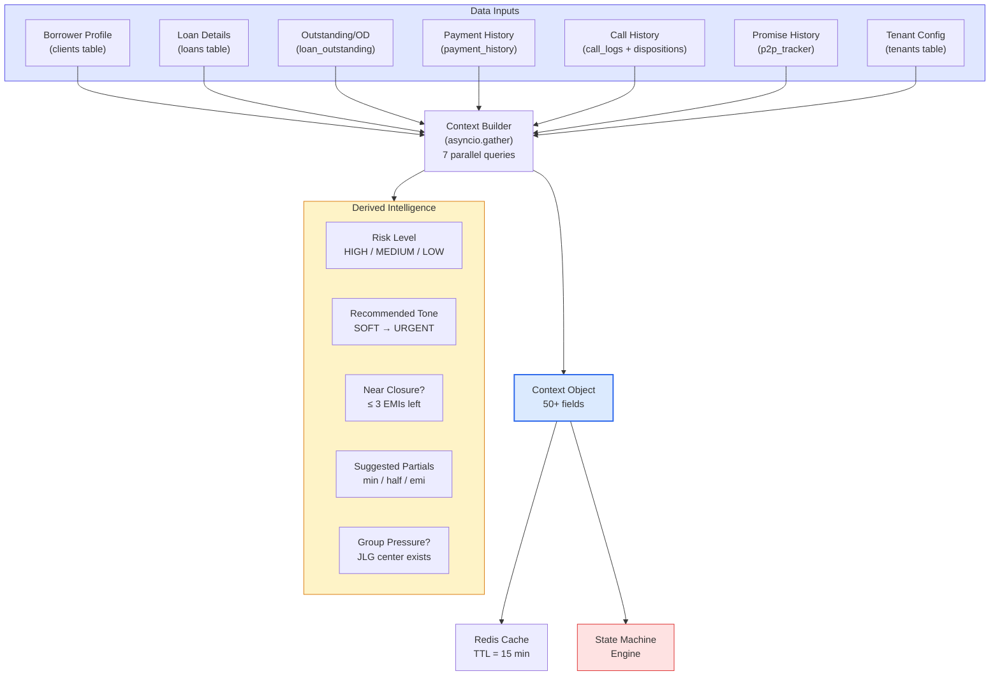
```mermaid
graph TB
    subgraph INPUTS["Data Inputs"]
        I1["Borrower Profile<br/>(clients table)"]
        I2["Loan Details<br/>(loans table)"]
        I3["Outstanding/OD<br/>(loan_outstanding)"]
        I4["Payment History<br/>(payment_history)"]
        I5["Call History<br/>(call_logs + dispositions)"]
        I6["Promise History<br/>(p2p_tracker)"]
        I7["Tenant Config<br/>(tenants table)"]
    end

    CTX_BUILD["Context Builder<br/>(asyncio.gather)<br/>7 parallel queries"]

    subgraph DERIVED["Derived Intelligence"]
        D1["Risk Level<br/>HIGH / MEDIUM / LOW"]
        D2["Recommended Tone<br/>SOFT → URGENT"]
        D3["Near Closure?<br/>≤ 3 EMIs left"]
        D4["Suggested Partials<br/>min / half / emi"]
        D5["Group Pressure?<br/>JLG center exists"]
    end

    CONTEXT["Context Object<br/>50+ fields"]
    REDIS["Redis Cache<br/>TTL = 15 min"]

    I1 & I2 & I3 & I4 & I5 & I6 & I7 --> CTX_BUILD
    CTX_BUILD --> DERIVED
    CTX_BUILD --> CONTEXT
    CONTEXT --> REDIS
    CONTEXT --> ENGINE["State Machine<br/>Engine"]

    style INPUTS fill:#e0e7ff,stroke:#4f46e5
    style DERIVED fill:#fef3c7,stroke:#d97706
    style CONTEXT fill:#dbeafe,stroke:#2563eb,stroke-width:2px
    style ENGINE fill:#fee2e2,stroke:#dc2626
```

---

## 7. 🔄 Process Flows

### Complete Call Execution Flow

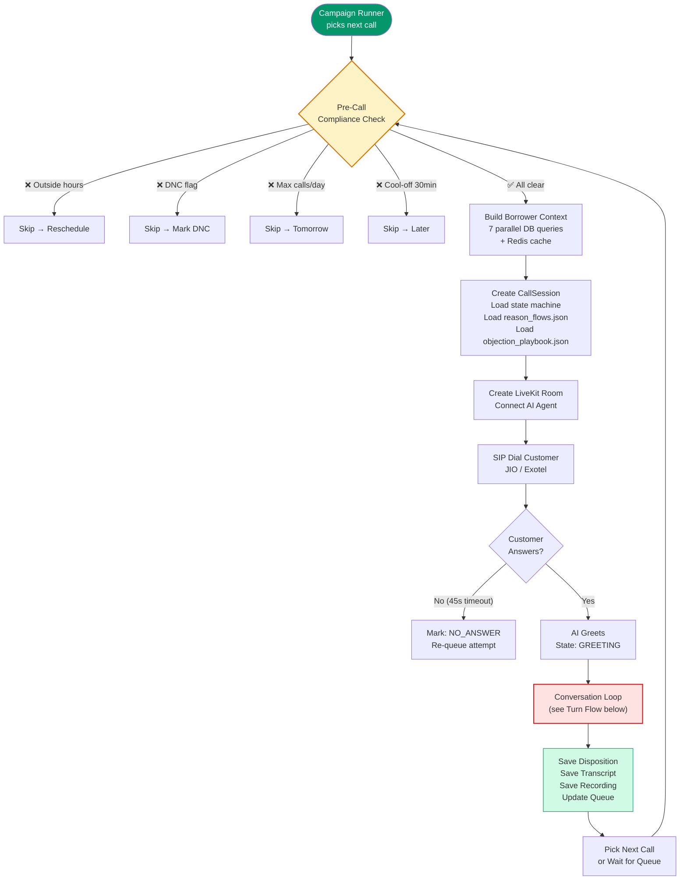
```mermaid
flowchart TD
    START(["Campaign Runner<br/>picks next call"]) --> COMPLIANCE

    COMPLIANCE{"Pre-Call<br/>Compliance Check"}
    COMPLIANCE -->|"❌ Outside hours"| SKIP1["Skip → Reschedule"]
    COMPLIANCE -->|"❌ DNC flag"| SKIP2["Skip → Mark DNC"]
    COMPLIANCE -->|"❌ Max calls/day"| SKIP3["Skip → Tomorrow"]
    COMPLIANCE -->|"❌ Cool-off 30min"| SKIP4["Skip → Later"]
    COMPLIANCE -->|"✅ All clear"| CTX_BUILD

    CTX_BUILD["Build Borrower Context<br/>7 parallel DB queries<br/>+ Redis cache"] --> CREATE_SESSION

    CREATE_SESSION["Create CallSession<br/>Load state machine<br/>Load reason_flows.json<br/>Load objection_playbook.json"] --> CREATE_ROOM

    CREATE_ROOM["Create LiveKit Room<br/>Connect AI Agent"] --> SIP_DIAL

    SIP_DIAL["SIP Dial Customer<br/>JIO / Exotel"] --> WAIT

    WAIT{"Customer<br/>Answers?"}
    WAIT -->|"No (45s timeout)"| NO_ANS["Mark: NO_ANSWER<br/>Re-queue attempt"]
    WAIT -->|"Yes"| GREET

    GREET["AI Greets<br/>State: GREETING"] --> CONV_LOOP

    CONV_LOOP["Conversation Loop<br/>(see Turn Flow below)"] --> SAVE

    SAVE["Save Disposition<br/>Save Transcript<br/>Save Recording<br/>Update Queue"] --> NEXT

    NEXT["Pick Next Call<br/>or Wait for Queue"]
    NEXT --> COMPLIANCE

    style START fill:#059669,color:#fff
    style COMPLIANCE fill:#fef3c7,stroke:#d97706,stroke-width:2px
    style CONV_LOOP fill:#fee2e2,stroke:#dc2626,stroke-width:2px
    style SAVE fill:#d1fae5,stroke:#059669
```

### Single Conversation Turn Flow

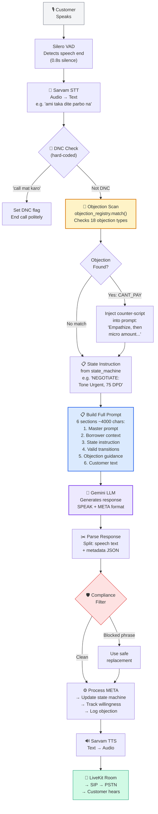
```mermaid
flowchart TD
    AUDIO["🎙️ Customer<br/>Speaks"] --> VAD["Silero VAD<br/>Detects speech end<br/>(0.8s silence)"]

    VAD --> STT["📝 Sarvam STT<br/>Audio → Text<br/>e.g. 'ami taka dite parbo na'"]

    STT --> DNC{"🚫 DNC Check<br/>(hard-coded)"}
    DNC -->|"'call mat karo'"| DNC_END["Set DNC flag<br/>End call politely"]
    DNC -->|"Not DNC"| OBJ_SCAN

    OBJ_SCAN["🎯 Objection Scan<br/>objection_registry.match()<br/>Checks 18 objection types"]

    OBJ_SCAN --> OBJ_RESULT{"Objection<br/>Found?"}
    OBJ_RESULT -->|"Yes: CANT_PAY"| INJECT["Inject counter-script<br/>into prompt:<br/>'Empathize, then<br/>micro amount...'"]
    OBJ_RESULT -->|"No match"| STATE_INST

    INJECT --> STATE_INST["📋 State Instruction<br/>from state_machine<br/>e.g. 'NEGOTIATE:<br/>Tone Urgent, 75 DPD'"]

    STATE_INST --> BUILD["📋 Build Full Prompt<br/>6 sections ~4000 chars:<br/>1. Master prompt<br/>2. Borrower context<br/>3. State instruction<br/>4. Valid transitions<br/>5. Objection guidance<br/>6. Customer text"]

    BUILD --> LLM["🤖 Gemini LLM<br/>Generates response<br/>SPEAK + META format"]

    LLM --> PARSE["✂️ Parse Response<br/>Split: speech text<br/>+ metadata JSON"]

    PARSE --> FILTER{"🛡️ Compliance<br/>Filter"}
    FILTER -->|"Blocked phrase"| REGEN["Use safe<br/>replacement"]
    FILTER -->|"Clean"| PROCESS

    REGEN --> PROCESS["⚙️ Process META<br/>→ Update state machine<br/>→ Track willingness<br/>→ Log objection"]

    PROCESS --> TTS["🔊 Sarvam TTS<br/>Text → Audio"]

    TTS --> PUBLISH["📡 LiveKit Room<br/>→ SIP → PSTN<br/>→ Customer hears"]

    style AUDIO fill:#f3f4f6,stroke:#6b7280
    style OBJ_SCAN fill:#fef3c7,stroke:#d97706,stroke-width:2px
    style BUILD fill:#dbeafe,stroke:#2563eb,stroke-width:2px
    style LLM fill:#ede9fe,stroke:#7c3aed,stroke-width:2px
    style FILTER fill:#fee2e2,stroke:#dc2626
    style PUBLISH fill:#d1fae5,stroke:#059669
```

### Campaign Runner Workflow

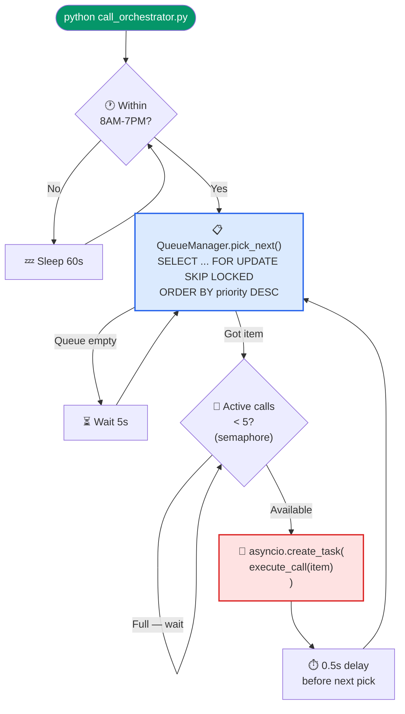
```mermaid
flowchart TD
    START(["python call_orchestrator.py"]) --> TIME_CHECK

    TIME_CHECK{"🕐 Within<br/>8AM-7PM?"}
    TIME_CHECK -->|"No"| SLEEP["💤 Sleep 60s"]
    SLEEP --> TIME_CHECK
    TIME_CHECK -->|"Yes"| PICK

    PICK["📋 QueueManager.pick_next()<br/>SELECT ... FOR UPDATE SKIP LOCKED<br/>ORDER BY priority DESC"]

    PICK -->|"Queue empty"| WAIT["⏳ Wait 5s"]
    WAIT --> PICK
    PICK -->|"Got item"| SEM

    SEM{"🔄 Active calls<br/>< 5?<br/>(semaphore)"}
    SEM -->|"Full — wait"| SEM
    SEM -->|"Available"| TASK

    TASK["🚀 asyncio.create_task(<br/>execute_call(item)<br/>)"]

    TASK --> DELAY["⏱️ 0.5s delay<br/>before next pick"]
    DELAY --> PICK

    style START fill:#059669,color:#fff
    style PICK fill:#dbeafe,stroke:#2563eb,stroke-width:2px
    style TASK fill:#fee2e2,stroke:#dc2626,stroke-width:2px
```

---

## 8. 🔄 Call State Machine

### State Categories

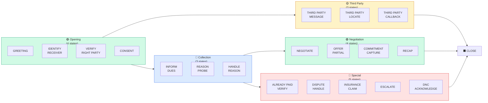
```mermaid
graph LR
    subgraph OPEN["🟢 Opening<br/>(4 states)"]
        G["GREETING"]
        IR["IDENTIFY<br/>RECEIVER"]
        VB["VERIFY<br/>RIGHT PARTY"]
        CO["CONSENT"]
    end

    subgraph TP["🟡 Third Party<br/>(3 states)"]
        TPM["THIRD PARTY<br/>MESSAGE"]
        TPL["THIRD PARTY<br/>LOCATE"]
        TPC["THIRD PARTY<br/>CALLBACK"]
    end

    subgraph CORE["🔵 Collection<br/>(3 states)"]
        IO["INFORM<br/>DUES"]
        RP["REASON<br/>PROBE"]
        HR["HANDLE<br/>REASON"]
    end

    subgraph NEG["🟢 Negotiation<br/>(4 states)"]
        N["NEGOTIATE"]
        OP["OFFER<br/>PARTIAL"]
        CC["COMMITMENT<br/>CAPTURE"]
        RC["RECAP"]
    end

    subgraph SPEC["🔴 Special<br/>(5 states)"]
        APV["ALREADY PAID<br/>VERIFY"]
        DH["DISPUTE<br/>HANDLE"]
        IC["INSURANCE<br/>CLAIM"]
        ESC["ESCALATE"]
        DNC["DNC<br/>ACKNOWLEDGE"]
    end

    CL["⬛ CLOSE"]

    OPEN --> TP
    OPEN --> CORE
    TP --> CL
    CORE --> NEG
    CORE --> SPEC
    NEG --> CL
    SPEC --> CL

    style OPEN fill:#d1fae5,stroke:#059669
    style TP fill:#fef3c7,stroke:#d97706
    style CORE fill:#dbeafe,stroke:#2563eb
    style NEG fill:#d1fae5,stroke:#059669
    style SPEC fill:#fee2e2,stroke:#dc2626
```

### Complete State Transition Diagram

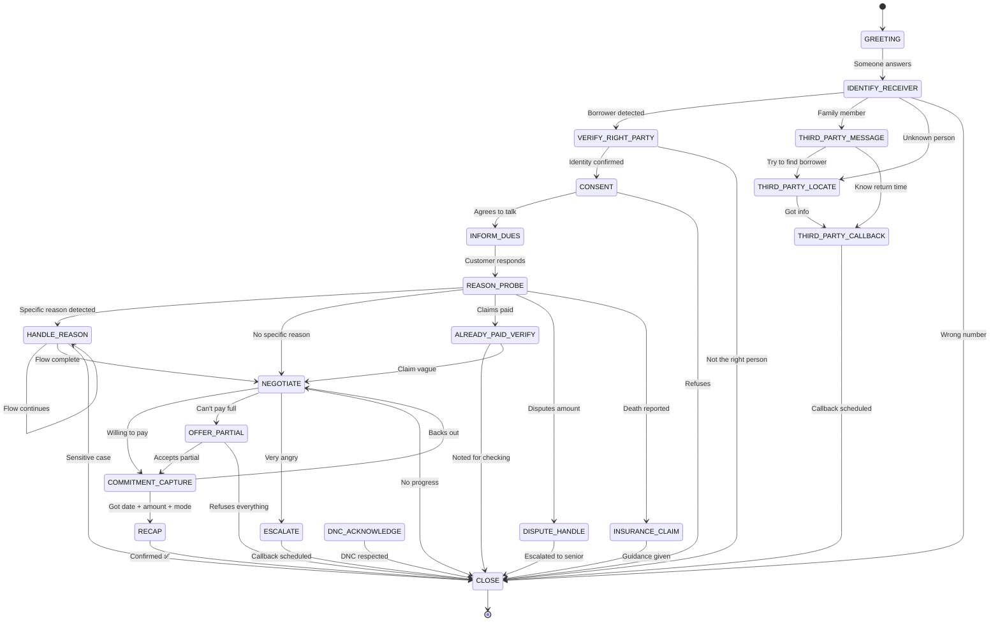
```mermaid
stateDiagram-v2
    [*] --> GREETING

    GREETING --> IDENTIFY_RECEIVER: Someone answers

    IDENTIFY_RECEIVER --> VERIFY_RIGHT_PARTY: Borrower detected
    IDENTIFY_RECEIVER --> THIRD_PARTY_MESSAGE: Family member
    IDENTIFY_RECEIVER --> THIRD_PARTY_LOCATE: Unknown person
    IDENTIFY_RECEIVER --> CLOSE: Wrong number

    VERIFY_RIGHT_PARTY --> CONSENT: Identity confirmed
    VERIFY_RIGHT_PARTY --> CLOSE: Not the right person

    CONSENT --> INFORM_DUES: Agrees to talk
    CONSENT --> CLOSE: Refuses

    THIRD_PARTY_MESSAGE --> THIRD_PARTY_LOCATE: Try to find borrower
    THIRD_PARTY_MESSAGE --> THIRD_PARTY_CALLBACK: Know return time
    THIRD_PARTY_LOCATE --> THIRD_PARTY_CALLBACK: Got info
    THIRD_PARTY_CALLBACK --> CLOSE: Callback scheduled

    INFORM_DUES --> REASON_PROBE: Customer responds

    REASON_PROBE --> HANDLE_REASON: Specific reason detected
    REASON_PROBE --> NEGOTIATE: No specific reason
    REASON_PROBE --> ALREADY_PAID_VERIFY: Claims paid
    REASON_PROBE --> DISPUTE_HANDLE: Disputes amount
    REASON_PROBE --> INSURANCE_CLAIM: Death reported

    HANDLE_REASON --> HANDLE_REASON: Flow continues
    HANDLE_REASON --> NEGOTIATE: Flow complete
    HANDLE_REASON --> CLOSE: Sensitive case

    NEGOTIATE --> COMMITMENT_CAPTURE: Willing to pay
    NEGOTIATE --> OFFER_PARTIAL: Can't pay full
    NEGOTIATE --> ESCALATE: Very angry
    NEGOTIATE --> CLOSE: No progress

    OFFER_PARTIAL --> COMMITMENT_CAPTURE: Accepts partial
    OFFER_PARTIAL --> CLOSE: Refuses everything

    COMMITMENT_CAPTURE --> RECAP: Got date + amount + mode
    COMMITMENT_CAPTURE --> NEGOTIATE: Backs out

    RECAP --> CLOSE: Confirmed ✅

    ALREADY_PAID_VERIFY --> CLOSE: Noted for checking
    ALREADY_PAID_VERIFY --> NEGOTIATE: Claim vague

    DISPUTE_HANDLE --> CLOSE: Escalated to senior
    INSURANCE_CLAIM --> CLOSE: Guidance given
    ESCALATE --> CLOSE: Callback scheduled

    DNC_ACKNOWLEDGE --> CLOSE: DNC respected

    CLOSE --> [*]
```

### Receiver Routing Logic

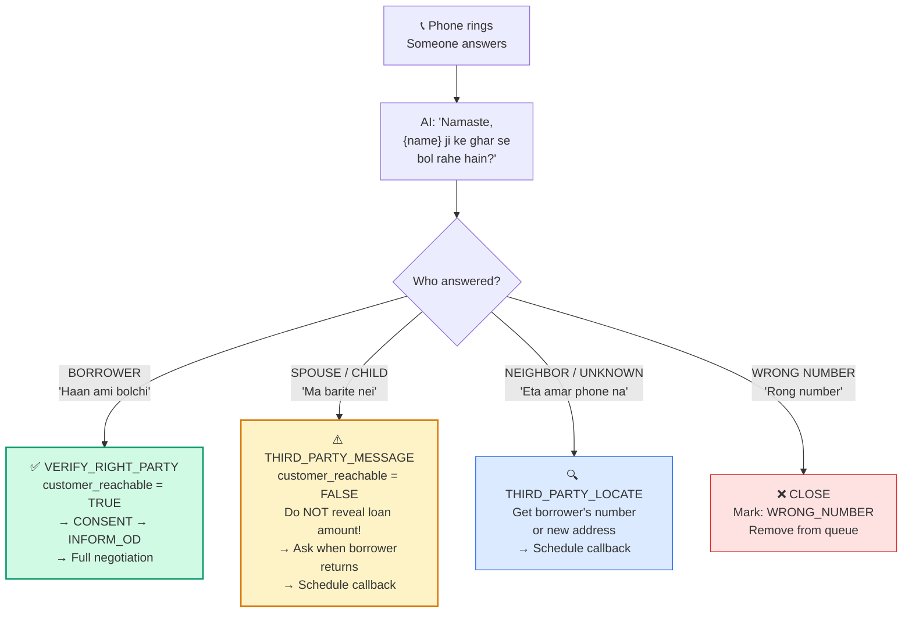
```mermaid
flowchart TD
    RING["📞 Phone rings<br/>Someone answers"] --> GREET["AI: 'Namaste,<br/>{name} ji ke ghar se<br/>bol rahe hain?'"]

    GREET --> WHO{"Who answered?"}

    WHO -->|"BORROWER<br/>'Haan ami bolchi'"| VERIFY["✅ VERIFY_RIGHT_PARTY<br/>customer_reachable = TRUE<br/>→ CONSENT → INFORM_OD<br/>→ Full negotiation"]

    WHO -->|"SPOUSE / CHILD<br/>'Ma barite nei'"| TP_MSG["⚠️ THIRD_PARTY_MESSAGE<br/>customer_reachable = FALSE<br/>Do NOT reveal loan amount!<br/>→ Ask when borrower returns<br/>→ Schedule callback"]

    WHO -->|"NEIGHBOR / UNKNOWN<br/>'Eta amar phone na'"| TP_LOC["🔍 THIRD_PARTY_LOCATE<br/>Get borrower's number<br/>or new address<br/>→ Schedule callback"]

    WHO -->|"WRONG NUMBER<br/>'Rong number'"| WRONG["❌ CLOSE<br/>Mark: WRONG_NUMBER<br/>Remove from queue"]

    style VERIFY fill:#d1fae5,stroke:#059669,stroke-width:2px
    style TP_MSG fill:#fef3c7,stroke:#d97706,stroke-width:2px
    style TP_LOC fill:#dbeafe,stroke:#2563eb
    style WRONG fill:#fee2e2,stroke:#dc2626
```

---

## 9. 🌳 Reason Flow Engine

### How JSON Drives Conversations

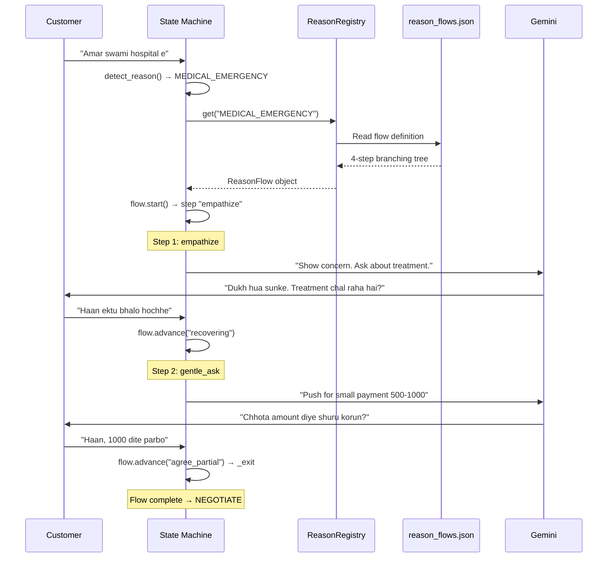
```mermaid
sequenceDiagram
    participant C as Customer
    participant SM as State Machine
    participant RR as ReasonRegistry
    participant JSON as reason_flows.json
    participant LLM as Gemini

    C->>SM: "Amar swami hospital e"
    SM->>SM: detect_reason() → MEDICAL_EMERGENCY
    SM->>RR: get("MEDICAL_EMERGENCY")
    RR->>JSON: Read flow definition
    JSON-->>RR: 4-step branching tree
    RR-->>SM: ReasonFlow object
    SM->>SM: flow.start() → step "empathize"

    Note over SM: Step 1: empathize
    SM->>LLM: "Show concern. Ask about treatment."
    LLM->>C: "Dukh hua sunke. Treatment chal raha hai?"

    C->>SM: "Haan ektu bhalo hochhe"
    SM->>SM: flow.advance("recovering")
    Note over SM: Step 2: gentle_ask
    SM->>LLM: "Push for small payment 500-1000"
    LLM->>C: "Chhota amount diye shuru korun?"

    C->>SM: "Haan, 1000 dite parbo"
    SM->>SM: flow.advance("agree_partial") → _exit
    Note over SM: Flow complete → NEGOTIATE
```

### All 23 Reason Categories

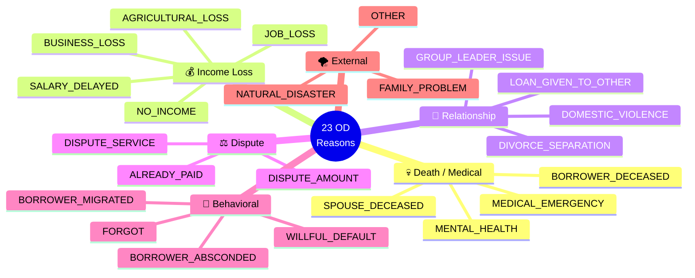
```mermaid
mindmap
  root((23 OD<br/>Reasons))
    💀 Death / Medical
      BORROWER_DECEASED
      SPOUSE_DECEASED
      MEDICAL_EMERGENCY
      MENTAL_HEALTH
    💰 Income Loss
      NO_INCOME
      JOB_LOSS
      BUSINESS_LOSS
      SALARY_DELAYED
      AGRICULTURAL_LOSS
    👥 Relationship
      LOAN_GIVEN_TO_OTHER
      DIVORCE_SEPARATION
      DOMESTIC_VIOLENCE
      GROUP_LEADER_ISSUE
    ⚖️ Dispute
      DISPUTE_AMOUNT
      DISPUTE_SERVICE
      ALREADY_PAID
    🚶 Behavioral
      FORGOT
      WILLFUL_DEFAULT
      BORROWER_ABSCONDED
      BORROWER_MIGRATED
    🌪️ External
      NATURAL_DISASTER
      FAMILY_PROBLEM
      OTHER
```

### Example: MEDICAL_EMERGENCY Flow

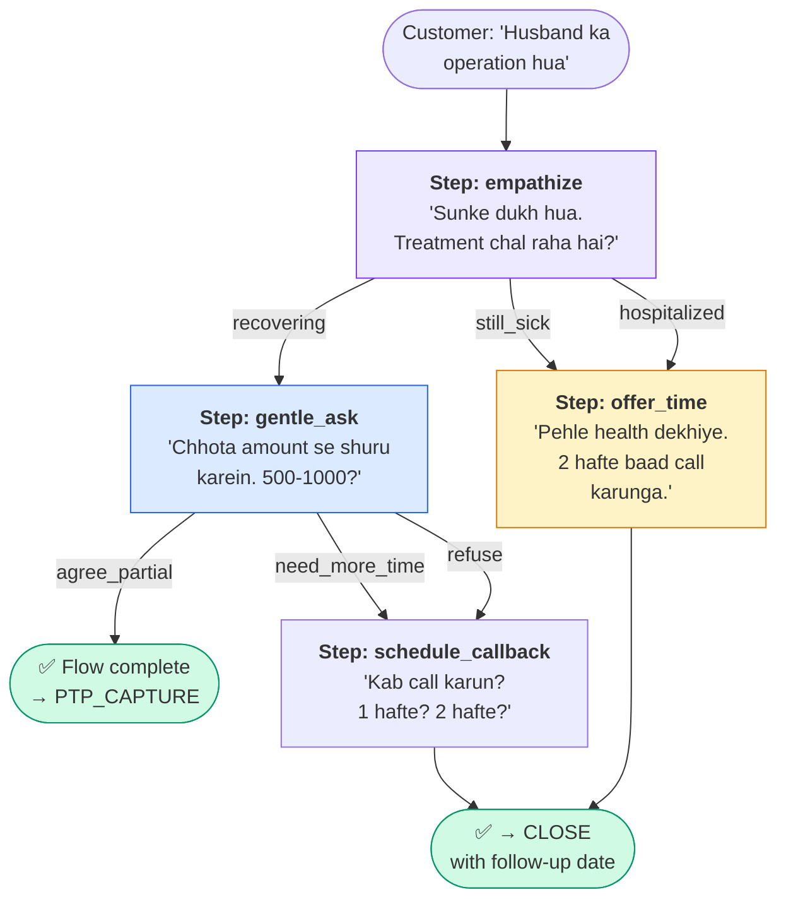
```mermaid
flowchart TD
    START(["Customer: 'Husband ka<br/>operation hua'"]) --> S1

    S1["<b>Step: empathize</b><br/>'Sunke dukh hua.<br/>Treatment chal raha hai?'"]

    S1 -->|"recovering"| S2["<b>Step: gentle_ask</b><br/>'Chhota amount se shuru<br/>karein. 500-1000?'"]
    S1 -->|"still_sick"| S3["<b>Step: offer_time</b><br/>'Pehle health dekhiye.<br/>2 hafte baad call<br/>karunga.'"]
    S1 -->|"hospitalized"| S3

    S2 -->|"agree_partial"| EXIT1(["✅ Flow complete<br/>→ PTP_CAPTURE"])
    S2 -->|"need_more_time"| S4["<b>Step: schedule_callback</b><br/>'Kab call karun?<br/>1 hafte? 2 hafte?'"]
    S2 -->|"refuse"| S4
    S3 --> EXIT2(["✅ → CLOSE<br/>with follow-up date"])
    S4 --> EXIT2

    style S1 fill:#ede9fe,stroke:#7c3aed
    style S2 fill:#dbeafe,stroke:#2563eb
    style S3 fill:#fef3c7,stroke:#d97706
    style EXIT1 fill:#d1fae5,stroke:#059669
    style EXIT2 fill:#d1fae5,stroke:#059669
```

---

## 10. 🎯 Objection Handling Pipeline

### Reason Flows vs Objection Playbook

```mermaid
graph TB
    subgraph RF["reason_flows.json<br/>(Layer 3)"]
        RF1["<b>WHAT:</b> WHY they can't pay"]
        RF2["<b>WHEN:</b> Detected ONCE at start"]
        RF3["<b>STRUCTURE:</b> Multi-step tree"]
        RF4["<b>EXAMPLE:</b> 'Husband died'<br/>→ 5-step insurance flow"]
    end

    subgraph OP["objection_playbook.json<br/>(Layer 4)"]
        OP1["<b>WHAT:</b> PUSHBACK during negotiation"]
        OP2["<b>WHEN:</b> Fires MULTIPLE times per call"]
        OP3["<b>STRUCTURE:</b> Single counter-script"]
        OP4["<b>EXAMPLE:</b> 'Paisa nahi hai'<br/>→ micro amount pitch"]
    end

    style RF fill:#dbeafe,stroke:#2563eb
    style OP fill:#fef3c7,stroke:#d97706
```

### Objection Detection and Injection Flow

```mermaid
flowchart LR
    CUST["Customer:<br/>'paisa nahi hai<br/>kahan se dun'"]
    SCAN["objection_registry<br/>.match()"]
    MATCH{"Keyword<br/>found?"}
    INJECT["Inject into<br/>LLM prompt"]
    VECTOR["pgvector<br/>semantic search<br/>(Phase 3)"]
    NONE["No injection<br/>LLM improvises"]
    LLM_GOOD["LLM follows<br/>tested playbook<br/>CONSISTENT ✅"]
    LLM_BAD["LLM guesses<br/>response<br/>INCONSISTENT ⚠️"]

    CUST --> SCAN --> MATCH
    MATCH -->|"Yes"| INJECT --> LLM_GOOD
    MATCH -->|"No"| VECTOR
    VECTOR -->|"Phase 3 match"| INJECT
    VECTOR -->|"No match"| NONE --> LLM_BAD

    style INJECT fill:#d1fae5,stroke:#059669,stroke-width:2px
    style NONE fill:#fee2e2,stroke:#dc2626
```

### All 18 Objection Types

```mermaid
graph TB
    subgraph M["💰 Money (4)"]
        O1["CANT_PAY_ANYTHING<br/><i>→ Empathize + micro amount</i>"]
        O2["SARCASTIC_SMALL_AMOUNT<br/><i>→ Accept and upsell!</i>"]
        O3["WILL_CLOSE_FULL_LATER<br/><i>→ Get date + push small now</i>"]
        O4["OTHER_LOANS_PRIORITY<br/><i>→ This loan's consequences</i>"]
    end

    subgraph A["🏃 Avoidance (4)"]
        O5["WILL_PAY_LATER_VAGUE<br/><i>→ Pin down exact date</i>"]
        O6["BUSY_RIGHT_NOW<br/><i>→ Lock callback time</i>"]
        O7["BORROWER_NOT_HOME<br/><i>→ Return time + message</i>"]
        O8["PHONE_NOT_MINE<br/><i>→ Get correct contact</i>"]
    end

    subgraph H["😠 Hostile (3)"]
        O9["DO_WHATEVER_YOU_WANT<br/><i>→ Calm + consequences</i>"]
        O10["THREATENING_LEGAL<br/><i>→ Offer grievance channel</i>"]
        O11["ASK_FOR_SUPERVISOR<br/><i>→ Schedule senior callback</i>"]
    end

    subgraph C["📋 Claims (4)"]
        O12["ALREADY_PAID_CLAIM<br/><i>→ Verify details</i>"]
        O13["AMOUNT_IS_WRONG<br/><i>→ Offer statement</i>"]
        O14["LOAN_NOT_FOR_ME<br/><i>→ Explain liability</i>"]
        O15["BLAMING_COMPANY<br/><i>→ Separate complaint + payment</i>"]
    end

    subgraph S["❤️ Sensitive (3)"]
        O16["STAFF_COMPLAINT<br/><i>→ Apologize + redirect</i>"]
        O17["EMOTIONAL_BREAKDOWN<br/><i>→ STOP payment talk</i>"]
        O18["DECEASED_FAMILY<br/><i>→ Condolence only</i>"]
    end

    style M fill:#d1fae5,stroke:#059669
    style A fill:#fef3c7,stroke:#d97706
    style H fill:#fee2e2,stroke:#dc2626
    style C fill:#dbeafe,stroke:#2563eb
    style S fill:#ede9fe,stroke:#7c3aed
```

---

## 11. 📋 Prompt Engineering Architecture

### What Gemini Sees Each Turn

```mermaid
graph TD
    subgraph PROMPT["LLM Prompt (~4000 chars)"]
        direction TB
        S1["<b>Section 1: Master System Prompt</b><br/>Identity, personality, compliance rules,<br/>SPEAK/META response format"]
        S2["<b>Section 2: Borrower Context</b><br/>Name, OD ₹11595, DPD 96 days,<br/>3 EMIs missed, 1 broken promise,<br/>payment pattern: IRREGULAR"]
        S3["<b>Section 3: State Instruction</b><br/>'NEGOTIATE. Tone: URGENT.<br/>Push for TODAY. Account NPA hone wala.'"]
        S4["<b>Section 4: Valid Transitions</b><br/>'next_state can be: ptp_capture,<br/>offer_partial, escalate, close'"]
        S5["<b>Section 5: Objection Guidance</b><br/>'OBJECTION: CANT_PAY. Strategy:<br/>Empathize then micro amount 200-500'"]
        S6["<b>Section 6: Customer Text</b><br/>'ami taka dite parbo na,<br/>kotha theke debo?'"]

        S1 --> S2 --> S3 --> S4 --> S5 --> S6
    end

    style S5 fill:#fef3c7,stroke:#d97706,stroke-width:2px
    style S3 fill:#dbeafe,stroke:#2563eb,stroke-width:2px
```

### DPD-Bucket Tone Ladder

```mermaid
graph LR
    subgraph TONES["Negotiation Tone by DPD"]
        T1["<b>0-30 DPD</b><br/>SMA0<br/>☺️ Soft reminder<br/>'Bas ek kisti<br/>reh gayi'"]
        T2["<b>31-60 DPD</b><br/>SMA1<br/>😐 Firm empathetic<br/>'Late fees badh<br/>rahi hain'"]
        T3["<b>61-90 DPD</b><br/>SMA2<br/>😟 Urgent<br/>'NPA hone wala,<br/>future loan<br/>nahi milega'"]
        T4["<b>90+ DPD</b><br/>NPA<br/>⚠️ Recovery<br/>'Company ko aage<br/>badhna padega'"]

        T1 --> T2 --> T3 --> T4
    end

    style T1 fill:#d1fae5,stroke:#059669
    style T2 fill:#fef3c7,stroke:#d97706
    style T3 fill:#fee2e2,stroke:#dc2626
    style T4 fill:#7f1d1d,stroke:#dc2626,color:#fff
```

---

## 12. 💾 Data Architecture

### Database Schema (16 Tables)

```mermaid
erDiagram
    tenants ||--o{ users : has
    tenants ||--o{ clients : has
    tenants ||--o{ loans : has
    tenants ||--o{ call_campaigns : runs
    tenants ||--o{ tenant_config : configures

    clients ||--o{ loans : takes
    clients ||--o{ call_queue : queued_for
    clients ||--o{ p2p_tracker : promises

    loans ||--o{ loan_outstanding : snapshots
    loans ||--o{ payment_history : payments

    call_campaigns ||--o{ call_queue : generates
    call_queue ||--o{ call_logs : produces
    call_logs ||--o{ call_dispositions : has

    clients ||--o{ officers : assigned_to
    clients ||--o{ org_units : belongs_to
    org_units ||--o{ org_units : parent_child

    tenants {
        uuid id PK
        string company_name
        jsonb config_json
    }

    clients {
        int id PK
        uuid tenant_id FK
        string client_name
        string phone_primary
        boolean dnc_flag
    }

    loans {
        int id PK
        uuid tenant_id FK
        int client_id FK
        decimal loan_amount
        decimal installment_amount
    }

    loan_outstanding {
        int id PK
        int loan_id FK
        decimal total_od
        int days_past_due
        string od_bucket
    }

    call_dispositions {
        int id PK
        int call_log_id FK
        string disposition_code
        string od_reason
        date p2p_date
        decimal p2p_amount
    }

    p2p_tracker {
        int id PK
        int client_id FK
        date promised_date
        decimal promised_amount
        string status
    }
```

### Disposition Output Structure

```mermaid
graph TD
    CALL_END["Call Ends"] --> DISP["session.get_disposition()"]

    DISP --> FIELDS["<b>Disposition Fields:</b><br/>disposition_code: PARTIAL_PTP<br/>od_reason: Husband operation<br/>od_reason_category: MEDICAL<br/>p2p_date: 2026-03-15<br/>p2p_amount: 1000<br/>p2p_mode: CASH<br/>customer_reachable: TRUE<br/>willingness_score: 3<br/>escalation_needed: FALSE"]

    FIELDS --> DB_SAVE["Save to<br/>call_dispositions"]

    DB_SAVE --> TRIGGER{"DB Trigger:<br/>Is PTP or<br/>PARTIAL_PTP?"}
    TRIGGER -->|"Yes"| P2P["Auto-create<br/>p2p_tracker entry"]
    TRIGGER -->|"No"| DONE["Done"]

    P2P --> CRON["Daily Cron:<br/>Match payments<br/>against promises"]
    CRON --> STATUS{"Payment<br/>received?"}
    STATUS -->|"Full"| KEPT["✅ KEPT"]
    STATUS -->|"Partial"| PARTIAL["⚠️ PARTIAL"]
    STATUS -->|"None by date"| BROKEN["❌ BROKEN<br/>Auto re-queue<br/>with HIGH priority"]

    style FIELDS fill:#dbeafe,stroke:#2563eb
    style P2P fill:#d1fae5,stroke:#059669
    style BROKEN fill:#fee2e2,stroke:#dc2626,stroke-width:2px
```

---

## 13. 🚀 Deployment Architecture

```mermaid
graph TB
    subgraph INTERNET["🌐 Internet"]
        BROWSER["MFI Staff<br/>Browser"]
        PHONE["Customer<br/>Phone (PSTN)"]
    end

    subgraph AZURE["☁️ Azure Cloud"]
        subgraph FRONTEND["Frontend"]
            NGINX["Nginx<br/>SSL + Reverse Proxy<br/>:443"]
        end

        subgraph BACKEND["Backend Services"]
            API["FastAPI<br/>:8000"]
            WORKER["call_orchestrator.py<br/>(Worker Process)<br/>×5 concurrent"]
            AGENT["livekit_agent.py<br/>(LiveKit Worker)"]
        end

        subgraph MEDIA["Media"]
            LK["LiveKit Server<br/>:7880 WS<br/>:5060 SIP"]
        end

        subgraph STORAGE["Data Stores"]
            PG[("PostgreSQL<br/>16 tables<br/>+ RLS")]
            RD[("Redis<br/>Context cache")]
            QD[("Qdrant<br/>Vector DB")]
            BLOB[("Blob Storage<br/>Recordings")]
        end
    end

    subgraph EXTERNAL["🔌 External APIs"]
        SARVAM["Sarvam AI<br/>STT + TTS"]
        GEMINI["Google Gemini<br/>LLM"]
        JIO["JIO SIP<br/>Trunk"]
        EXO["Exotel<br/>API"]
    end

    BROWSER --> NGINX --> API
    PHONE --> JIO --> LK
    PHONE --> EXO --> LK
    LK <--> AGENT
    WORKER --> API
    WORKER --> PG & RD
    WORKER --> SARVAM & GEMINI
    AGENT --> SARVAM & GEMINI
    API --> PG & RD & QD

    style AZURE fill:#f0f9ff,stroke:#0284c7
    style WORKER fill:#fee2e2,stroke:#dc2626,stroke-width:2px
    style AGENT fill:#ede9fe,stroke:#7c3aed,stroke-width:2px
```

### Docker Compose Services

```mermaid
graph LR
    subgraph DOCKER["docker-compose.yml"]
        SVC_API["backend<br/>:8000"]
        SVC_AGENT["livekit-agent<br/>(worker)"]
        SVC_LK["livekit-server<br/>:7880"]
        SVC_PG["postgres<br/>:5432"]
        SVC_RD["redis<br/>:6379"]
        SVC_QD["qdrant<br/>:6333"]
    end

    SVC_API --> SVC_PG & SVC_RD & SVC_QD
    SVC_AGENT --> SVC_LK
    SVC_AGENT --> SVC_PG & SVC_RD
    SVC_LK --> SVC_AGENT

    style DOCKER fill:#f0f9ff,stroke:#0284c7
```

---

## 14. 🔒 Security and Compliance

### Compliance Architecture

```mermaid
graph TB
    subgraph PRE["🔒 Pre-Call (Hard-Coded)"]
        P1["Time window check<br/>8AM - 7PM only"]
        P2["DNC flag check<br/>from clients table"]
        P3["Max 3 calls/day<br/>per client"]
        P4["30-min cool-off<br/>between calls"]
    end

    subgraph MID["🛡️ Mid-Call (App-Level)"]
        M1["Blocked phrase filter<br/>on EVERY AI response<br/>before TTS"]
        M2["DNC keyword detection<br/>'call mat karo' →<br/>immediate end"]
        M3["No OD disclosure<br/>to third parties"]
        M4["No AI identity<br/>revelation"]
    end

    subgraph POST["📋 Post-Call"]
        O1["Call recording<br/>saved to blob"]
        O2["Transcript logged<br/>to call_logs"]
        O3["Disposition<br/>structured capture"]
    end

    subgraph POLICY["⚙️ Tenant Policy"]
        TP1["Banking day<br/>enforcement"]
        TP2["Payment mode<br/>validation"]
        TP3["Holiday calendar"]
        TP4["Working days<br/>configuration"]
    end

    PRE --> MID --> POST
    POLICY --> PRE & MID

    style PRE fill:#fee2e2,stroke:#dc2626
    style MID fill:#fef3c7,stroke:#d97706
    style POST fill:#d1fae5,stroke:#059669
    style POLICY fill:#e0e7ff,stroke:#4f46e5
```

### RBI Fair Practices Code Compliance

```mermaid
graph TD
    RBI["RBI Fair Practices Code<br/>for MFI/NBFC"]

    RBI --> R1["No calls outside<br/>8AM-7PM ✅<br/><i>TenantPolicy.within_call_window()</i>"]
    RBI --> R2["No abusive language ✅<br/><i>ComplianceFilter.BLOCKED_PHRASES</i>"]
    RBI --> R3["Respect DNC requests ✅<br/><i>is_dnc_request() hard-coded</i>"]
    RBI --> R4["No third-party<br/>disclosure ✅<br/><i>State: THIRD_PARTY_MESSAGE</i>"]
    RBI --> R5["No threats of<br/>legal action ✅<br/><i>Blocked: police, jail, court</i>"]
    RBI --> R6["Maintain call records ✅<br/><i>CallMediaRecorder + transcript</i>"]

    style RBI fill:#fee2e2,stroke:#dc2626,stroke-width:2px
```

---

## 15. 🔌 Integration Points

```mermaid
graph TB
    subgraph PLATFORM["AI Collection Platform"]
        API["FastAPI<br/>REST API"]
        AGENT["Voice Agent"]
    end

    subgraph VOICE_PROVIDERS["Voice Providers<br/>(Provider-Agnostic)"]
        VP1["Sarvam STT/TTS<br/>(Current)"]
        VP2["Deepgram<br/>(Alternative)"]
        VP3["Azure Speech<br/>(Alternative)"]
    end

    subgraph LLM_PROVIDERS["LLM Providers<br/>(Provider-Agnostic)"]
        LP1["Gemini 2.0 Flash<br/>(Current)"]
        LP2["GPT-4o<br/>(Alternative)"]
        LP3["Claude<br/>(Alternative)"]
    end

    subgraph TELEPHONY_PROVIDERS["Telephony<br/>(Dual-Mode)"]
        TP1["JIO SIP<br/>(Primary)"]
        TP2["Exotel<br/>(Secondary)"]
        TP3["Twilio<br/>(Future)"]
        TP4["Knowlarity<br/>(Future)"]
    end

    subgraph DATA_SOURCES["Data Sources"]
        DS1["Excel Upload"]
        DS2["LOS API"]
        DS3["CBS Integration"]
    end

    AGENT --> VP1
    AGENT --> LP1
    AGENT --> TP1 & TP2
    API --> DS1 & DS2 & DS3

    style PLATFORM fill:#dbeafe,stroke:#2563eb,stroke-width:2px
    style VOICE_PROVIDERS fill:#ede9fe,stroke:#7c3aed
    style LLM_PROVIDERS fill:#d1fae5,stroke:#059669
    style TELEPHONY_PROVIDERS fill:#fee2e2,stroke:#dc2626
    style DATA_SOURCES fill:#fef3c7,stroke:#d97706
```

---

## 16. 📈 Scalability Design

### Horizontal Scaling

```mermaid
graph TB
    subgraph LB["Load Balancer"]
        NGINX["Nginx<br/>SSL Termination"]
    end

    subgraph WORKERS["Worker Pool<br/>(Horizontal Scale)"]
        W1["Worker 1<br/>5 concurrent calls"]
        W2["Worker 2<br/>5 concurrent calls"]
        W3["Worker 3<br/>5 concurrent calls"]
        WN["Worker N<br/>5 concurrent calls"]
    end

    subgraph SHARED["Shared State"]
        PG[("PostgreSQL<br/>SELECT FOR UPDATE<br/>SKIP LOCKED")]
        RD[("Redis<br/>Distributed cache")]
    end

    NGINX --> W1 & W2 & W3 & WN
    W1 & W2 & W3 & WN --> PG & RD

    style WORKERS fill:#dbeafe,stroke:#2563eb
    style SHARED fill:#fef3c7,stroke:#d97706
```

### Vector DB Growth Path

```mermaid
graph LR
    P1["<b>Phase 1: NOW</b><br/>Keyword matching<br/>from JSON file<br/>~80% accuracy"]
    P2["<b>Phase 2: 100 calls</b><br/>Add real transcript<br/>phrases to JSON<br/>~90% accuracy"]
    P3["<b>Phase 3: 1000 calls</b><br/>pgvector embeddings<br/>semantic matching<br/>~97% accuracy"]
    P4["<b>Phase 4: Scale</b><br/>Fine-tuned<br/>classifier model<br/>~99% accuracy"]

    P1 ==> P2 ==> P3 ==> P4

    style P1 fill:#d1fae5,stroke:#059669,stroke-width:2px
    style P2 fill:#dbeafe,stroke:#2563eb
    style P3 fill:#ede9fe,stroke:#7c3aed
    style P4 fill:#f3f4f6,stroke:#6b7280,stroke-dasharray:5 5
```

---

## 17. 🛠️ Technology Stack

```mermaid
graph TB
    subgraph BACKEND_STACK["Backend"]
        B1["Python 3.12<br/>FastAPI"]
        B2["asyncio<br/>asyncpg"]
        B3["httpx<br/>aioredis"]
    end

    subgraph FRONTEND_STACK["Frontend"]
        F1["HTML / CSS / JS<br/>(No TypeScript)"]
        F2["Plain vanilla<br/>No build steps"]
    end

    subgraph AI_STACK["AI / ML"]
        A1["Gemini 2.0 Flash<br/>(LLM)"]
        A2["Sarvam saaras:v3<br/>(STT)"]
        A3["Sarvam bulbul:v2<br/>(TTS)"]
        A4["Silero VAD<br/>(Voice Activity)"]
    end

    subgraph MEDIA_STACK["Media / Telephony"]
        M1["LiveKit<br/>WebRTC Server"]
        M2["LiveKit Agents<br/>Framework"]
        M3["SIP Bridge<br/>PSTN Gateway"]
    end

    subgraph DATA_STACK["Data"]
        D1["PostgreSQL 16<br/>+ pgvector"]
        D2["Redis 7<br/>Cache + Sessions"]
        D3["Qdrant<br/>Vector Search"]
    end

    subgraph INFRA_STACK["Infrastructure"]
        I1["Docker<br/>Compose"]
        I2["Nginx<br/>Reverse Proxy"]
        I3["Azure VM<br/>Cloud Host"]
    end

    style BACKEND_STACK fill:#dbeafe,stroke:#2563eb
    style FRONTEND_STACK fill:#f3f4f6,stroke:#6b7280
    style AI_STACK fill:#ede9fe,stroke:#7c3aed
    style MEDIA_STACK fill:#fee2e2,stroke:#dc2626
    style DATA_STACK fill:#fef3c7,stroke:#d97706
    style INFRA_STACK fill:#d1fae5,stroke:#059669
```

---

> **Document Metadata**
>
> **Project:** Universal AI Microfinance OD Collection Calling Platform
> **Architecture:** Multi-tenant SaaS, provider-agnostic, 7-layer intelligence
> **Files:** 14 Python/JSON files in `od_layer3/` + voice pipeline + FastAPI
> **Database:** 16 PostgreSQL tables with RLS + Redis + Qdrant
> **Languages:** Hindi, Bengali, English (expandable to 10+ Indian languages)
> **Compliance:** RBI Fair Practices Code enforced at application layer
>
> *All diagrams render with Mermaid in GitHub, VS Code, Notion, Obsidian, or any compatible viewer.*
