# AI Microfinance OD Collection Calling Platform

## Complete System Documentation

> **9 files. 7 layers. 21 states. 23 reason flows. 18 objection counters.**
> Full-duplex AI voice agent that calls overdue borrowers, negotiates payment,
> and logs structured dispositions — like a domain-expert human caller.

---

## Table of Contents

1. [System Overview](#1-system-overview)
2. [The 7-Layer Architecture](#2-the-7-layer-architecture)
3. [All 9 Files — What Each Does](#3-all-9-files--what-each-does)
4. [File Dependency Map](#4-file-dependency-map)
5. [Call Orchestrator — The Main Loop](#5-call-orchestrator--the-main-loop)
6. [One Call End-to-End](#6-one-call-end-to-end)
7. [One Conversation Turn — Trace Through Every File](#7-one-conversation-turn--trace-through-every-file)
8. [State Machine — 21 States](#8-state-machine--21-states)
9. [Reason Flows — How JSON Drives Conversations](#9-reason-flows--how-json-drives-conversations)
10. [Objection Playbook — Layer 4](#10-objection-playbook--layer-4)
11. [Prompt Builder — What the LLM Sees](#11-prompt-builder--what-the-llm-sees)
12. [Context Builder — Pre-Call Intelligence](#12-context-builder--pre-call-intelligence)
13. [Disposition Output — What Gets Saved](#13-disposition-output--what-gets-saved)
14. [Vector DB (pgvector) — Phase 3 Upgrade](#14-vector-db-pgvector--phase-3-upgrade)
15. [Campaign Runner — Batch Processing](#15-campaign-runner--batch-processing)
16. [Deployment Architecture](#16-deployment-architecture)
17. [How to Add New Reasons / Objections](#17-how-to-add-new-reasons--objections)

---

## 1. System Overview

```mermaid
graph LR
    A["📤 Excel Upload"] -->|"Field Mapping"| B["💾 Database<br/>16 tables"]
    B -->|"context_builder.py"| C["🤖 AI Agent<br/>Gets Full Context"]
    C -->|"LiveKit + SIP"| D["📞 Customer<br/>Call"]
    D -->|"Conversation"| E["📝 Disposition<br/>OD Reason + P2P"]
    E -->|"Auto Trigger"| F["📊 P2P Tracker<br/>+ Dashboard"]
    F -->|"Broken Promise?"| G["🔁 Re-queue<br/>Follow-up Call"]
    G --> C

    style A fill:#dbeafe,stroke:#2563eb
    style B fill:#fef3c7,stroke:#d97706
    style C fill:#ede9fe,stroke:#7c3aed
    style D fill:#fee2e2,stroke:#dc2626
    style E fill:#d1fae5,stroke:#059669
    style F fill:#fef3c7,stroke:#d97706
    style G fill:#fee2e2,stroke:#dc2626
```

The platform follows a simple cycle: **Upload → Database → AI Context → Call → Disposition → P2P Track → Re-queue → Repeat**

---

## 2. The 7-Layer Architecture

```mermaid
graph TB
    subgraph L7["Layer 7: COMPLIANCE GUARDRAILS"]
        L7A["Pre-call checks<br/>Time, DNC, max calls"]
        L7B["Mid-call filter<br/>Blocked phrases"]
        L7C["DNC detection<br/>Hard-coded keywords"]
    end

    subgraph L6["Layer 6: DISPOSITION ENGINE"]
        L6A["Runtime capture<br/>p2p_date, amount, reason"]
        L6B["Post-call extraction<br/>Structured from transcript"]
    end

    subgraph L5["Layer 5: DPD-BUCKET PROMPTS"]
        L5A["SMA0: Soft reminder"]
        L5B["SMA1: Firm empathetic"]
        L5C["SMA2: Urgent"]
        L5D["NPA: Recovery mode"]
    end

    subgraph L4["Layer 4: OBJECTION PLAYBOOK"]
        L4A["18 objections<br/>objection_playbook.json"]
        L4B["Keyword matching<br/>objection_registry.py"]
        L4C["Vector search<br/>pgvector (Phase 3)"]
    end

    subgraph L3["Layer 3: STATE MACHINE + REASON FLOWS"]
        L3A["21 call states<br/>call_state_machine.py"]
        L3B["23 reason flows<br/>reason_flows.json"]
    end

    subgraph L2["Layer 2: BORROWER CONTEXT"]
        L2A["7 parallel DB queries<br/>context_builder.py"]
        L2B["Redis cache<br/>15 min TTL"]
    end

    subgraph L1["Layer 1: VOICE PIPELINE"]
        L1A["LiveKit WebRTC"]
        L1B["Sarvam STT/TTS"]
        L1C["Silero VAD"]
        L1D["Gemini LLM"]
    end

    L1 --> L2 --> L3 --> L4 --> L5 --> L6 --> L7

    style L7 fill:#fee2e2,stroke:#dc2626
    style L6 fill:#d1fae5,stroke:#059669
    style L5 fill:#ede9fe,stroke:#7c3aed
    style L4 fill:#fef3c7,stroke:#d97706
    style L3 fill:#dbeafe,stroke:#2563eb
    style L2 fill:#e0e7ff,stroke:#4f46e5
    style L1 fill:#f3f4f6,stroke:#6b7280
```

**Key principle:** Domain expertise lives in Layers 2-6, NOT in the LLM itself. The LLM (Layer 1) provides language capability. Everything else — context, state logic, negotiation strategy, objection handling, compliance — is built in Python and JSON around it.

---

## 3. All 9 Files — What Each Does

| File | Layer | Role | Editable? |
|------|-------|------|-----------|
| `call_orchestrator.py` | Orchestrator | Main loop: LiveKit + STT + LLM + TTS + DB | Config only |
| `prompt_builder.py` | Core | Builds LLM prompt, parses response, runs objection matching | Rarely |
| `call_state_machine.py` | Layer 3 | 21 states, transitions, per-state instructions | Add states |
| `reason_registry.py` | Layer 3 | Loads reason flows from JSON file | Never |
| `reason_flows.json` | Layer 3 | 23 OD reason conversation trees | **Often — add reasons here** |
| `objection_registry.py` | Layer 4 | Keyword matching for mid-call objections | Never |
| `objection_playbook.json` | Layer 4 | 18 objection counter-scripts | **Often — add objections here** |
| `context_builder.py` | Layer 2 | 7 parallel DB queries → borrower context | Add fields |
| `vector_db_setup.py` | Layer 4+ | pgvector setup for semantic matching | Phase 3 |

---

## 4. File Dependency Map

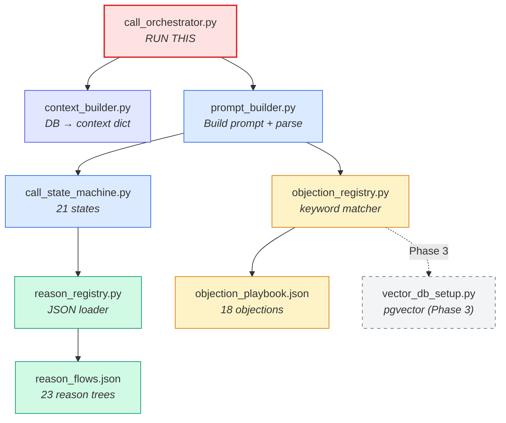

**Reading this diagram:** Arrow means "imports / calls". So `call_orchestrator.py` imports and calls `context_builder.py` and `prompt_builder.py`. The `prompt_builder` imports and calls both the `call_state_machine` and the `objection_registry`. The state machine imports `reason_registry` which reads `reason_flows.json`. Dashed arrow to `vector_db_setup.py` means it's a future Phase 3 upgrade.

---

## 5. Call Orchestrator — The Main Loop

The orchestrator has 6 internal components:

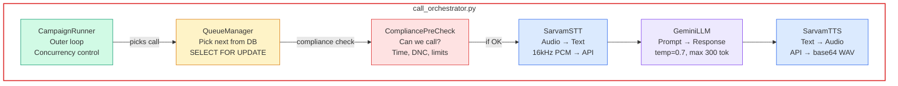

### CampaignRunner Flow

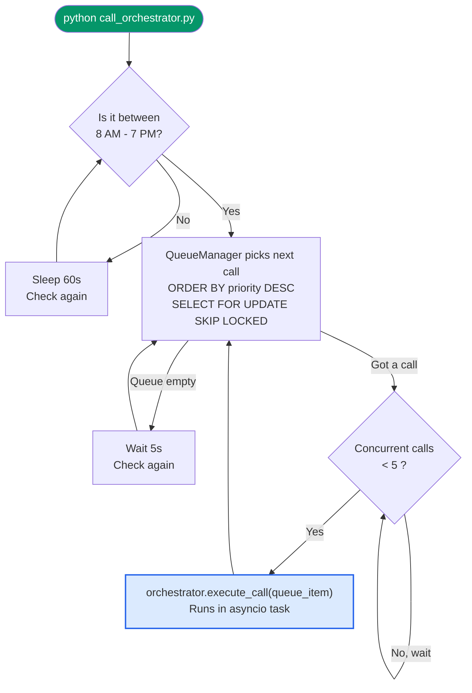

---

## 6. One Call End-to-End

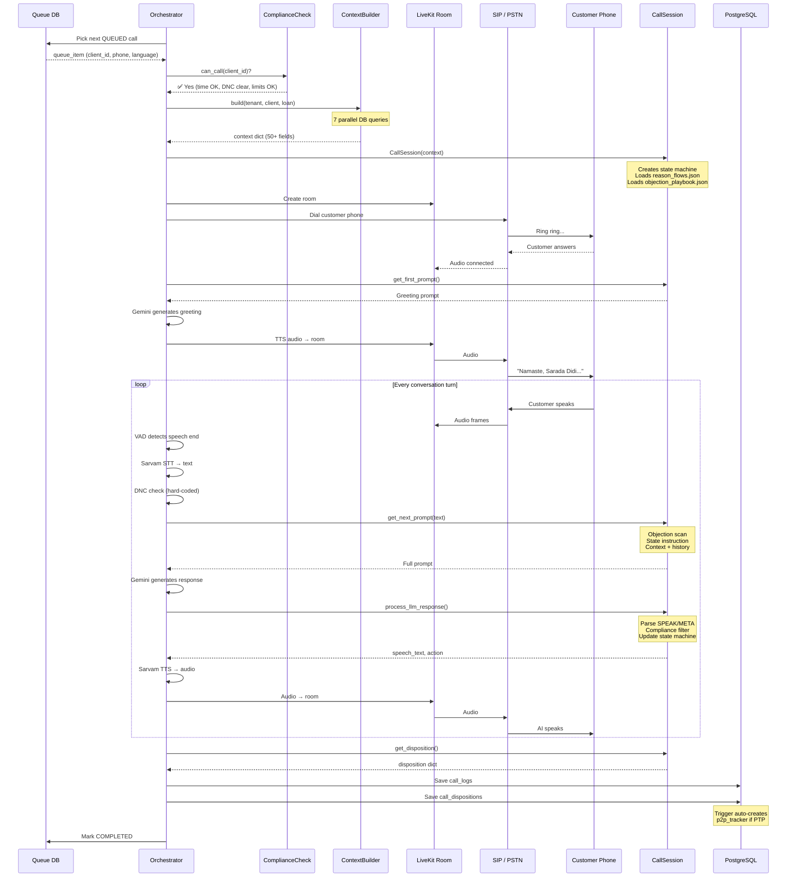

---

## 7. One Conversation Turn — Trace Through Every File

Customer says **"ami taka dite parbo na, kotha theke debo?"** during NEGOTIATE state.

```mermaid
flowchart TD
    CUST["👤 Customer speaks<br/>'ami taka dite parbo na'"] --> LK["🔊 LiveKit Room<br/>Audio frames collected"]
    LK --> VAD["🎙️ Silero VAD<br/>Detects speech end<br/>(0.8s silence)"]
    VAD --> STT["📝 Sarvam STT<br/>Audio → 'ami taka dite parbo na,<br/>kotha theke debo?'"]

    STT --> DNC{"🚫 DNC Check<br/>(hard-coded)<br/>'call mat karo'<br/>found?"}
    DNC -->|"Yes"| END_DNC["Set DNC flag<br/>End call"]
    DNC -->|"No"| PROMPT["📋 prompt_builder.py<br/>session.get_next_prompt()"]

    PROMPT --> OBJ["🎯 objection_registry.py<br/>Scans trigger phrases<br/>'dite parbo na' found!"]
    OBJ --> INJECT["📋 Injects counter-script<br/>'EMPATHIZE_THEN_MICRO_AMOUNT:<br/>Sirf 200-500 rupaye...'"]

    INJECT --> STATE["🔄 call_state_machine.py<br/>State: NEGOTIATE<br/>Instruction: 'Tone: Urgent.<br/>75 DPD. 2 broken promises.'"]
    STATE --> CTX["📊 Borrower context<br/>Name, OD amount, history,<br/>last reason, payment pattern"]
    CTX --> FULL["📋 Full prompt assembled<br/>(~4000 chars, 6 sections)"]

    FULL --> GEMINI["🤖 Gemini LLM<br/>Generates response<br/>~400ms"]
    GEMINI --> PARSE["✂️ ResponseParser<br/>Split: SPEAK text + META json"]

    PARSE --> FILTER{"🛡️ Compliance Filter<br/>'police', 'jail',<br/>'arrest' found?"}
    FILTER -->|"Blocked"| REGEN["Regenerate or<br/>use safe fallback"]
    FILTER -->|"Clean"| PROCESS["⚙️ TurnProcessor<br/>Read META json →<br/>call state machine methods"]

    PROCESS --> SM_UPDATE["🔄 State machine updated<br/>willingness=low recorded<br/>objection logged in notes"]

    SM_UPDATE --> TTS["🔊 Sarvam TTS<br/>'Main samajhti hoon...' →<br/>Audio bytes"]
    TTS --> PUBLISH["📡 LiveKit room<br/>Audio → SIP → PSTN"]
    PUBLISH --> PHONE["📱 Customer hears<br/>'Main samajhti hoon,<br/>sirf 200 rupaye dein...'"]

    style CUST fill:#f3f4f6,stroke:#6b7280
    style OBJ fill:#fef3c7,stroke:#d97706,stroke-width:2px
    style STATE fill:#dbeafe,stroke:#2563eb,stroke-width:2px
    style GEMINI fill:#ede9fe,stroke:#7c3aed,stroke-width:2px
    style FILTER fill:#fee2e2,stroke:#dc2626
    style PHONE fill:#d1fae5,stroke:#059669
```

### Which file runs at each step

| Step | File | Method |
|------|------|--------|
| Audio collection | `call_orchestrator.py` | `_collect_customer_speech()` |
| STT | `call_orchestrator.py` | `SarvamSTT.transcribe()` |
| DNC detection | `call_orchestrator.py` | `_is_dnc_request()` |
| Build prompt | `prompt_builder.py` | `PromptBuilder.build_turn_prompt()` |
| Objection scan | `objection_registry.py` | `ObjectionRegistry.match()` |
| Counter-script data | `objection_playbook.json` | `counter_script` field |
| State instruction | `call_state_machine.py` | `get_state_instruction()` → `_negotiate()` |
| Reason flow step | `reason_flows.json` | via `reason_registry.py` |
| Context data | `context_builder.py` | cached in `CallSession` |
| LLM call | `call_orchestrator.py` | `GeminiLLM.generate()` |
| Parse response | `prompt_builder.py` | `ResponseParser.parse()` |
| Compliance filter | `prompt_builder.py` | `ComplianceFilter.filter()` |
| Update state | `prompt_builder.py` | `TurnProcessor.process()` |
| TTS | `call_orchestrator.py` | `SarvamTTS.synthesize()` |
| Publish audio | `call_orchestrator.py` | `_publish_audio()` |

---

## 8. State Machine — 21 States

### State Categories

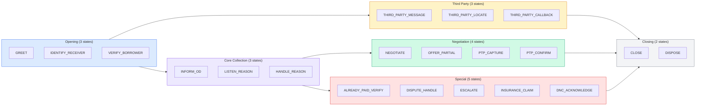

### Complete State Transitions

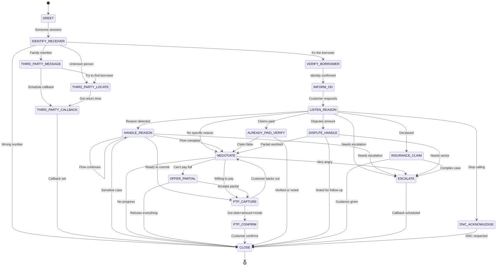

### Who Picked Up? — Receiver Routing

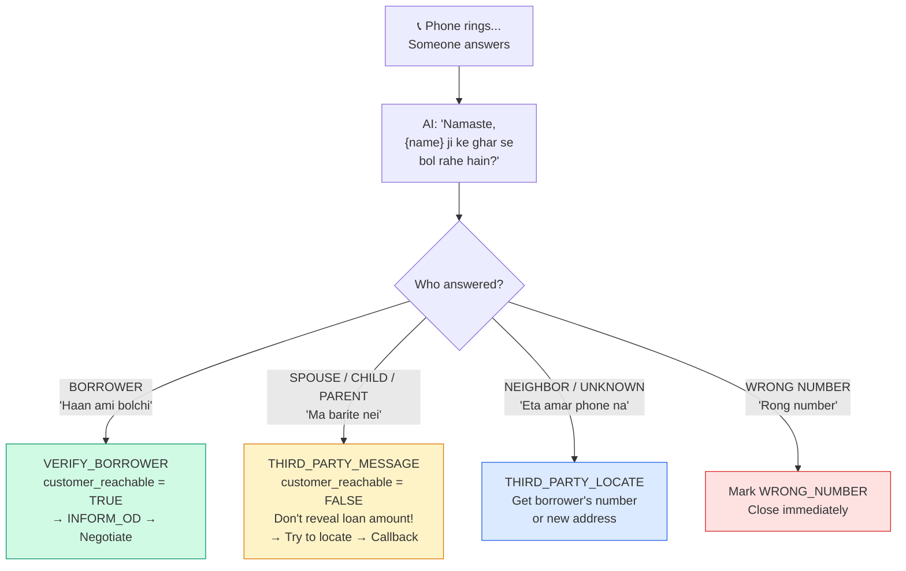

> **Real-world insight:** In your Bengali call transcriptions, ~60% of calls were answered by a third party (child, spouse, neighbor). The state machine handles all these cases because they were built from your actual recordings.

---

## 9. Reason Flows — How JSON Drives Conversations

### How it works

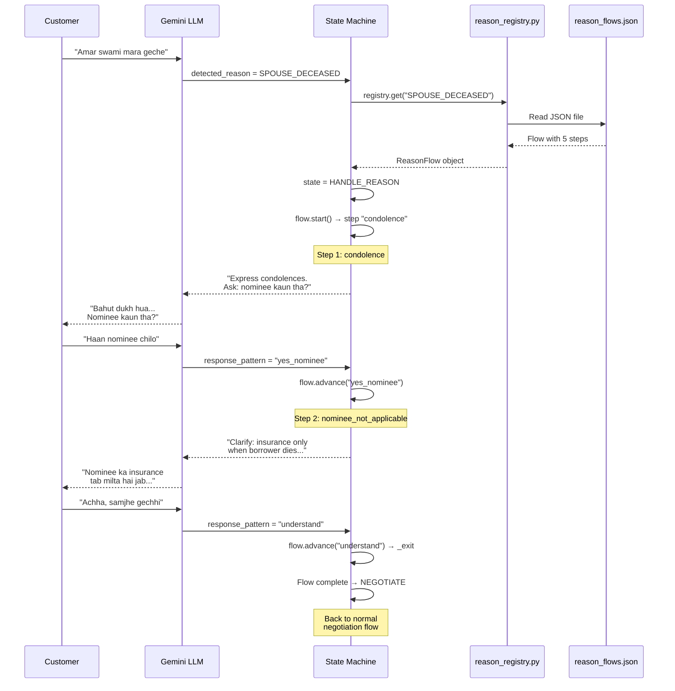

### All 23 Reasons

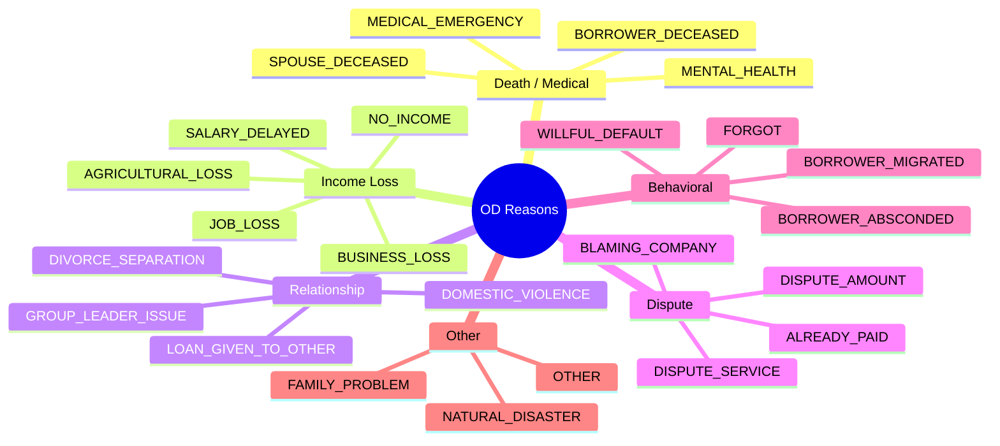

### Example Flow: MEDICAL_EMERGENCY (from reason_flows.json)

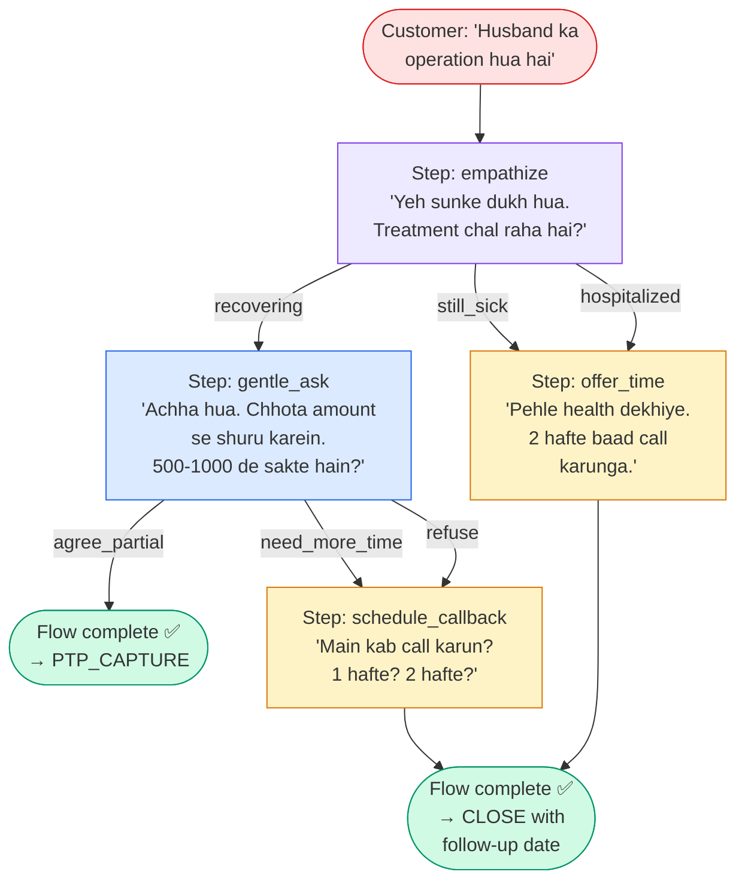

---

## 10. Objection Playbook — Layer 4

### Reason Flows vs Objection Playbook

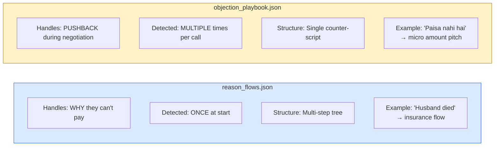

### How Objection Matching Works

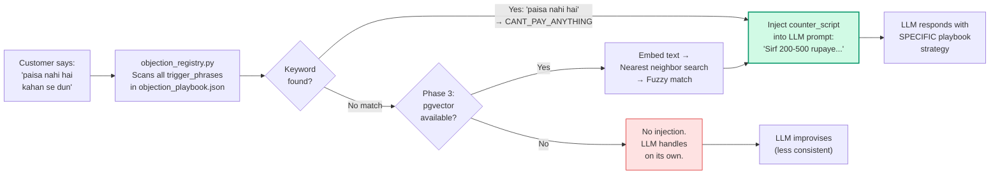

### All 18 Objections

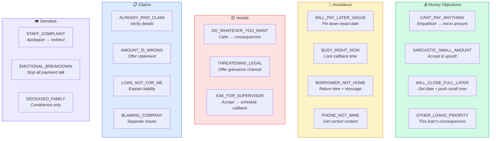

---

## 11. Prompt Builder — What the LLM Sees

Every conversation turn, Gemini receives a prompt with 6 sections:

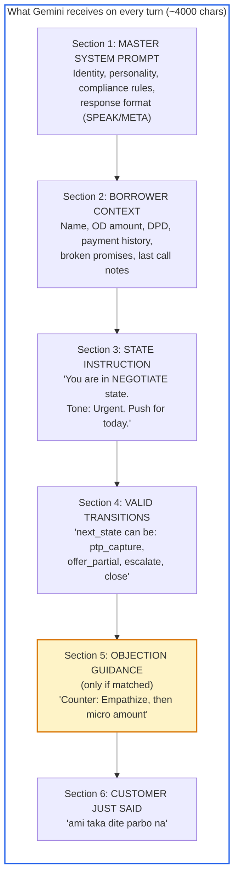

### LLM Response Format

The LLM must respond in this exact format:

```
SPEAK: <what to say to customer in their language>
---
META: {"next_state": "...", "detected_intent": "...", ...}
```

The `ResponseParser` splits this into speech (→ TTS) and metadata (→ state machine updates).

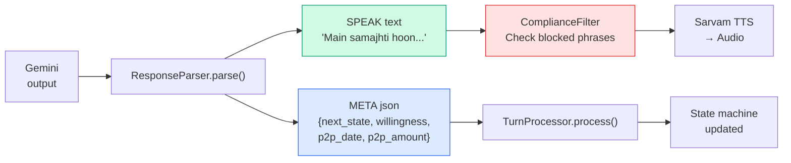

### TurnProcessor — What META Fields Trigger

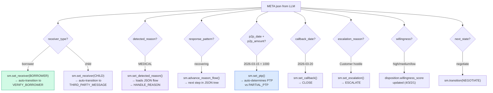

---

## 12. Context Builder — Pre-Call Intelligence

```mermaid
flowchart LR
    subgraph QUERIES["7 Parallel DB Queries (asyncio.gather)"]
        Q1["borrower profile<br/>clients + org_units + officers"]
        Q2["loan details<br/>loans table"]
        Q3["outstanding / OD<br/>loan_outstanding (latest)"]
        Q4["payment history<br/>aggregated + last 5"]
        Q5["call history<br/>call_logs + dispositions"]
        Q6["promise history<br/>p2p_tracker stats"]
        Q7["tenant config<br/>company name, settings"]
    end

    QUERIES --> CTX["Context Object<br/>50+ fields"]

    CTX --> DERIVED["Derived Intelligence<br/>(calculated, not queried)"]

    subgraph CALC["Derived Fields"]
        C1["risk_level: HIGH/MEDIUM/LOW"]
        C2["recommended_tone: SOFT → URGENT"]
        C3["is_near_closure: True/False"]
        C4["suggested_partial_amounts: min/half/emi"]
        C5["group_pressure_possible: True/False"]
        C6["payment_regularity: REGULAR/IRREGULAR/CHRONIC"]
    end

    DERIVED --> CALC
    CTX --> REDIS["Redis Cache<br/>TTL = 15 min"]
    CTX --> SESSION["CallSession<br/>Used for entire call"]

    style QUERIES fill:#e0e7ff,stroke:#4f46e5
    style CTX fill:#dbeafe,stroke:#2563eb,stroke-width:2px
    style CALC fill:#fef3c7,stroke:#d97706
```

---

## 13. Disposition Output — What Gets Saved

After every call, `session.get_disposition()` returns:

```mermaid
graph TD
    subgraph DISP["call_dispositions table"]
        D1["disposition_code: PTP / PARTIAL_PTP / CALLBACK /<br/>REFUSED / DISPUTE / ESCALATED / etc."]
        D2["od_reason: 'Husband had heart operation'"]
        D3["od_reason_category: MEDICAL_EMERGENCY"]
        D4["p2p_date: 2026-03-15"]
        D5["p2p_amount: 1000"]
        D6["p2p_mode: CASH"]
        D7["customer_reachable: TRUE"]
        D8["willingness_score: 3 (1=hostile → 5=eager)"]
        D9["escalation_needed: FALSE"]
        D10["follow_up_date: 2026-03-20"]
        D11["agent_notes: 'Customer recovering from surgery.<br/>Agreed to partial. Objections: CANT_PAY_ANYTHING.'"]
    end

    DISP --> TRIGGER{"Is disposition<br/>PTP or PARTIAL_PTP?"}
    TRIGGER -->|"Yes"| P2P["DB trigger auto-creates<br/>p2p_tracker entry"]
    TRIGGER -->|"No"| DONE["Done"]

    P2P --> CRON["Daily cron job<br/>matches payments<br/>against promises"]
    CRON --> STATUS{"Payment<br/>received?"}
    STATUS -->|"Full"| KEPT["status = KEPT ✅"]
    STATUS -->|"Partial"| PARTIAL["status = PARTIAL ⚠️"]
    STATUS -->|"None"| BROKEN["status = BROKEN ❌<br/>breach_count += 1<br/>Auto re-queue call"]

    style DISP fill:#dbeafe,stroke:#2563eb
    style P2P fill:#d1fae5,stroke:#059669
    style BROKEN fill:#fee2e2,stroke:#dc2626
```

---

## 14. Vector DB (pgvector) — Phase 3 Upgrade

### Growth Path

```mermaid
graph LR
    P1["Phase 1: NOW<br/>Keyword matching<br/>from JSON file<br/>~80% hit rate"]
    P2["Phase 2: 100 calls<br/>Add real phrases<br/>from transcripts<br/>~90% hit rate"]
    P3["Phase 3: 1000 calls<br/>pgvector embeddings<br/>semantic matching<br/>~97% hit rate"]
    P4["Phase 4: Scale<br/>Fine-tuned classifier<br/>model<br/>~99% hit rate"]

    P1 --> P2 --> P3 --> P4

    style P1 fill:#d1fae5,stroke:#059669,stroke-width:2px
    style P2 fill:#dbeafe,stroke:#2563eb
    style P3 fill:#ede9fe,stroke:#7c3aed
    style P4 fill:#f3f4f6,stroke:#6b7280,stroke-dasharray:5 5
```

### What Goes in pgvector

```mermaid
graph TD
    subgraph SOURCES["Two data sources"]
        S1["Source 1: PLAYBOOK PHRASES<br/>All trigger_phrases from<br/>objection_playbook.json<br/>~150 phrases"]
        S2["Source 2: TRANSCRIPT PHRASES<br/>Real customer phrases from<br/>your call recordings<br/>~50-200 phrases (grows weekly)"]
    end

    SOURCES --> EMBED["Embedding API<br/>Sarvam (768d) / OpenAI (1536d)<br/>/ Local MiniLM (384d)"]

    EMBED --> TABLE["objection_embeddings table<br/><br/>objection_code | phrase | lang | embedding<br/>CANT_PAY | 'paisa nahi hai' | hi | [0.12, ...]<br/>CANT_PAY | 'taka dite parbo na' | bn | [0.08, ...]<br/>CANT_PAY | 'ami ekhon kichu korte parchina' | bn | [0.11, ...]"]

    TABLE --> SEARCH["Runtime: Customer says something<br/>→ Embed → Nearest neighbor<br/>→ If similarity > 0.78 → Match"]

    style SOURCES fill:#fef3c7,stroke:#d97706
    style TABLE fill:#dbeafe,stroke:#2563eb,stroke-width:2px
```

---

## 15. Campaign Runner — Batch Processing

```mermaid
flowchart TD
    START(["CampaignRunner.run()"]) --> TIME

    TIME{"8 AM - 7 PM?"}
    TIME -->|"No"| SLEEP["Sleep 60s"] --> TIME
    TIME -->|"Yes"| PICK

    PICK["QueueManager.pick_next()<br/>SELECT ... FOR UPDATE SKIP LOCKED<br/>ORDER BY priority DESC"]
    PICK -->|"Empty"| WAIT5["Sleep 5s"] --> PICK
    PICK -->|"Got queue_item"| SEM

    SEM{"Active calls < 5<br/>(semaphore)?"}
    SEM -->|"Full"| SEM
    SEM -->|"Available"| TASK

    TASK["asyncio.create_task(<br/>  orchestrator.execute_call(item)<br/>)"]

    TASK --> PICK

    subgraph CALL_TASK["Inside each call task"]
        direction TB
        T1["Compliance check"]
        T2["Build context"]
        T3["Create LiveKit room + SIP dial"]
        T4["Conversation loop"]
        T5["Save disposition"]
        T6["Mark queue COMPLETED/FAILED"]
        T1 --> T2 --> T3 --> T4 --> T5 --> T6
    end

    TASK -.-> CALL_TASK

    style CALL_TASK fill:#dbeafe,stroke:#2563eb
```

---

## 16. Deployment Architecture

```mermaid
graph TB
    subgraph INTERNET["Internet"]
        USER["MFI Users<br/>(Browser)"]
        PHONE["Customer<br/>Phone (PSTN)"]
    end

    subgraph AZURE["Azure Cloud"]
        NGINX["Nginx<br/>SSL + Reverse Proxy"]
        API["FastAPI<br/>:8000"]
        WORKER["call_orchestrator.py<br/>(Worker Process)"]
        LK["LiveKit Server<br/>:7880"]
        SIP_B["SIP Bridge<br/>:5060"]

        PG["PostgreSQL<br/>(16 tables)"]
        REDIS["Redis<br/>(Context cache)"]
        BLOB["Blob Storage<br/>(Recordings)"]
    end

    subgraph EXTERNAL["External APIs"]
        SARVAM["Sarvam AI<br/>STT + TTS"]
        GEMINI["Google Gemini<br/>LLM"]
        TELE["Exotel / Twilio<br/>Telephony"]
    end

    USER --> NGINX --> API
    PHONE --> TELE --> SIP_B --> LK
    WORKER --> LK
    WORKER --> PG
    WORKER --> REDIS
    WORKER --> SARVAM
    WORKER --> GEMINI
    API --> PG

    style WORKER fill:#fee2e2,stroke:#dc2626,stroke-width:2px
    style LK fill:#ede9fe,stroke:#7c3aed
    style PG fill:#dbeafe,stroke:#2563eb
```

---

## 17. How to Add New Reasons / Objections

### Adding a New OD Reason

```mermaid
flowchart LR
    A["1. Open<br/>reason_flows.json"] --> B["2. Add new key<br/>with steps array"]
    B --> C["3. Add enum value in<br/>call_state_machine.py<br/>DetectedReason"]
    C --> D["4. Restart app<br/>(or call reload())"]
    D --> E["Done ✅<br/>AI now handles<br/>this reason"]

    style A fill:#d1fae5,stroke:#059669
    style E fill:#d1fae5,stroke:#059669
```

Example: adding "Election Duty" as a new reason:

**Step 1:** Add to `reason_flows.json`:
```json
"ELECTION_DUTY": {
    "label": "Away on Election Duty",
    "objective": "Get return date, push for online payment",
    "sensitivity": "LOW",
    "entry_step": "when_back",
    "exit_to_state": "ptp_capture",
    "steps": [
        {
            "id": "when_back",
            "agent_action": "Ask: When will you return from duty? Can you pay online meanwhile?",
            "expected_responses": ["can_pay_online", "will_pay_after_return"],
            "next_step_map": {"can_pay_online": "_exit", "will_pay_after_return": "set_date"},
            "fallback_step": "set_date"
        },
        {
            "id": "set_date",
            "agent_action": "Get exact return date. Set PTP for that date.",
            "expected_responses": [],
            "next_step_map": {},
            "fallback_step": "_exit"
        }
    ]
}
```

**Step 2:** Add to `call_state_machine.py` DetectedReason enum:
```python
ELECTION_DUTY = "ELECTION_DUTY"
```

**Step 3:** Restart. Done.

### Adding a New Objection

```mermaid
flowchart LR
    A["1. Open<br/>objection_playbook.json"] --> B["2. Add new key<br/>with trigger_phrases<br/>+ counter_script"]
    B --> C["3. Restart app<br/>(or call reload())"]
    C --> D["Done ✅<br/>Objection auto-detected<br/>and countered"]

    style A fill:#fef3c7,stroke:#d97706
    style D fill:#fef3c7,stroke:#d97706
```

No code changes needed for new objections. Just add JSON.

---

## Summary: The Complete Data Journey

```mermaid
graph TD
    UPLOAD["📤 Excel Upload<br/>(5 sheets)"]
    DB["💾 Database<br/>(16 tables)"]
    CTX["📊 Context Builder<br/>(7 queries → 50+ fields)"]
    SM["🔄 State Machine<br/>(21 states)"]
    RF["📘 Reason Flows<br/>(23 from JSON)"]
    OBJ["🎯 Objection Playbook<br/>(18 from JSON)"]
    PROMPT["📋 Prompt Builder<br/>(6 sections → 4000 chars)"]
    LLM["🤖 Gemini LLM<br/>(generates response)"]
    VOICE["🔊 Voice Pipeline<br/>(Sarvam STT/TTS + LiveKit)"]
    PHONE["📞 Customer Call"]
    DISP["📝 Disposition<br/>(structured output)"]
    P2P["📊 P2P Tracker<br/>(promise tracking)"]
    REQUEUE["🔁 Re-queue<br/>(broken promises)"]

    UPLOAD --> DB --> CTX --> PROMPT
    SM --> PROMPT
    RF --> SM
    OBJ --> PROMPT
    PROMPT --> LLM --> VOICE --> PHONE
    PHONE --> VOICE --> LLM
    PHONE --> DISP --> P2P
    P2P -->|"BROKEN"| REQUEUE --> CTX

    style UPLOAD fill:#f3f4f6,stroke:#6b7280
    style DB fill:#fef3c7,stroke:#d97706
    style CTX fill:#e0e7ff,stroke:#4f46e5
    style SM fill:#dbeafe,stroke:#2563eb
    style RF fill:#d1fae5,stroke:#059669
    style OBJ fill:#fef3c7,stroke:#d97706
    style PROMPT fill:#dbeafe,stroke:#2563eb,stroke-width:2px
    style LLM fill:#ede9fe,stroke:#7c3aed,stroke-width:2px
    style VOICE fill:#fee2e2,stroke:#dc2626
    style PHONE fill:#fee2e2,stroke:#dc2626,stroke-width:2px
    style DISP fill:#d1fae5,stroke:#059669
    style P2P fill:#d1fae5,stroke:#059669
    style REQUEUE fill:#fee2e2,stroke:#dc2626
```

---

*Built for the Universal AI Calling Platform. Multi-tenant, provider-agnostic, works with any MFI / NBFC. All diagrams render with Mermaid in GitHub, VS Code, Notion, or any Markdown viewer.*
