# Sampurna HR Portal — User Manual

**Version:** 1.0 (FULL)  
**Last Updated:** 09 Feb 2026  
**Document Type:** Operating Manual (SOP) + Business Rules + System Logic  
**Audience:** HR Ops, Interview Panel, Reception/Admin Support, System Admin  
**Scope:** Form-1 (`candidate_application`) → Dashboard Docs Check → Interview Scheduling → WhatsApp → QR → Form-2 (`details_form`) → Interview → Form-3 (`interview_question`) → Selection → Email → Form-4 (`onboarding_form`)

## Form naming (system modules)
Use these exact module names in code, dashboard labels, and documentation:

- **Form-1 (`candidate_application`)** → `candidate_application`
- **Form-2 (`details_form`)** → `details_form`
- **Form-3 (`interview_question`)** → `interview_question`
- **Form-4 (`onboarding_form`)** → `onboarding_form`

---

## What this system does (plain English)
This system runs the entire candidate pipeline in a controlled way:

- **Form-1 (`candidate_application`)** creates the candidate record and stores initial documents (resume/certificates).
- **HR Dashboard** is the control center to verify documents, schedule interview, send WhatsApp updates, and mark selection.
- **QR + Form-2 (`details_form`)** ensures candidates fill detailed info only when they physically visit the office.
- **Form-3 (`interview_question`)** lets HR/interviewer record a structured evaluation (role-based question set).
- **Selection + Email** finalizes decision and communicates next steps.
- **Form-4 (`onboarding_form`)** captures final joining/onboarding details for selected candidates.

> **Single Source of Truth:** The **candidate mobile number** entered in **Form-1 (`candidate_application`)** is the key identity for Form-2 (`details_form`) login and later tracking.

---

## Table of Contents
1. [Roles & Permissions](#roles--permissions)  
2. [Core Logic (Eligibility + Identity)](#core-logic-eligibility--identity)  
3. [Form-1 (`candidate_application`) Eligibility Rules](#form-1-eligibility-rules)  
4. [30-Day Eligibility Rule (Cooldown / Reapply)](#30-day-eligibility-rule-cooldown--reapply)  
5. [Mobile Number Logic (Identity Key)](#mobile-number-logic-identity-key)  
6. [Duplicate Handling Logic](#duplicate-handling-logic)  
7. [Status Pipeline Logic](#status-pipeline-logic)  
8. [End-to-End Workflow Summary](#end-to-end-workflow-summary)  
9. [Workflow Diagrams](#workflow-diagrams)  
10. [Step 1 — Candidate fills Form-1 (`candidate_application`)](#step-1--candidate-fills-form-1)  
11. [Step 2 — HR Dashboard: Candidate Documents verification](#step-2--hr-dashboard-candidate-documents-verification)  
12. [Step 3 — HR schedules interview in Form-1 (`candidate_application`)](#step-3--hr-schedules-interview-in-form-1)  
13. [Step 4 — HR sends WhatsApp interview message](#step-4--hr-sends-whatsapp-interview-message)  
14. [Walk-in Form (Office Visit) — QR + Form-2 (`details_form`)](#walk-in-form-office-visit--qr--form-2-details_form)  
14. [Step 5 — Candidate arrives: QR scan](#step-5--candidate-arrives-qr-scan)  
15. [Step 6 — Candidate logs in to Form-2 (`details_form`) with same number](#step-6--candidate-logs-in-to-form-2-with-same-number)  
16. [Step 7 — Candidate fills Form-2 (`details_form`)](#step-7--candidate-fills-form-2)  
17. [Step 8 — HR conducts interview](#step-8--hr-conducts-interview)  
18. [Step 9 — Form-3 (`interview_question`) (HR Only): Evaluation + Role questions](#step-9--form-3-hr-only-evaluation--role-questions)  
19. [Step 10 — Dashboard Selection: Selected / Not Selected](#step-10--dashboard-selection-selected--not-selected)  
20. [Step 11 — Send email to Selected candidates](#step-11--send-email-to-selected-candidates)  
21. [Step 12 — Candidate Visit 2: Form-4 (`onboarding_form`) joining](#step-12--candidate-visit-2-form-4-joining)  
22. [Checklists (HR + Candidate)](#checklists-hr--candidate)  
23. [Common Issues & Fixes](#common-issues--fixes)  
24. [Operational Tips (Do’s & Don’ts)](#operational-tips-dos--donts)

---

## Roles & Permissions

### Candidate
- ✅ Can fill **Form-1 (`candidate_application`)**
- ✅ Can fill **Form-2 (`details_form`)** (only after **QR scan** and **mobile verification**)
- ✅ Can fill **Form-4 (`onboarding_form`)** (only after selection/joining call)

### HR (Ops)
- ✅ Uses **Dashboard**
- ✅ Verifies documents in **Candidate Documents**
- ✅ Schedules interview in **Form-1 (`candidate_application`)**
- ✅ Sends WhatsApp messages
- ✅ Marks selection in Dashboard
- ✅ Initiates selection email

### Interviewer / HR Panel
- ✅ Uses **Form-3 (`interview_question`)** (HR-only evaluation form)

### Reception / Admin Support
- ✅ Shows QR code to candidates during office visits
- ✅ Helps candidate open the Form-2 (`details_form`) login page (no data entry on their behalf unless HR policy allows)

---

## Core Logic (Eligibility + Identity)

### System invariants (rules that should never break)
1. **One mobile number = one candidate journey (primary identity)**
2. **Form-2 (`details_form`) login mobile must equal Form-1 (`candidate_application`) mobile**
3. **Interview scheduling should happen only after document verification**
4. **Form-3 (`interview_question`) evaluation should exist before final selection** (best practice)
5. **Form-4 (`onboarding_form`) should be filled only by Selected candidates (joining stage)**

### Why mobile number is the identity key
- WhatsApp messaging depends on mobile number
- Candidate can always provide mobile number (even if they forget app ID)
- It is the cleanest join key between Form-1 (`candidate_application`) → Form-2 (`details_form`) → Form-3 (`interview_question`) → Selection → Form-4 (`onboarding_form`)

---

## Form-1 (`candidate_application`) Eligibility Rules

Form-1 (`candidate_application`) is the entry gate. Candidate can submit Form-1 (`candidate_application`) only if the following pass.

### A) Mobile validation (minimum)
- Exactly **10 digits**
- Digits only
- Not dummy patterns (0000000000 / 1111111111 / etc.)
- (Recommended) first digit 6–9

### B) Allowed to apply (business policy)
- Candidate is not blocked/blacklisted (if you maintain a list)
- Candidate is not violating the duplicate + 30-day rule (below)
- Candidate selects a valid designation/role (must exist in master list)
- Candidate uploads resume (recommended mandatory)

### Eligibility decision flow (Form-1 (`candidate_application`) gate)
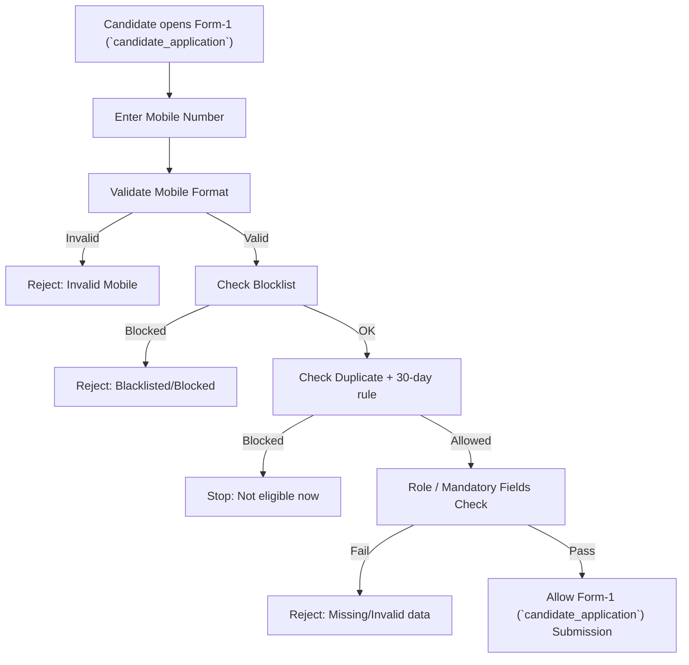

---

## 30-Day Eligibility Rule (Cooldown / Reapply)

This is the rule you asked to include: **same mobile number cannot submit Form-1 (`candidate_application`) again within 30 days** in certain cases.

### What the 30-day rule means
If the candidate has a previous application tied to the same mobile number:
- If **rejected**, they must wait **30 days** before applying again.
- If application is still **active/in-process**, reapply is blocked until HR closes the case.
- If **selected/joined**, reapply is blocked (or routed to HR admin review).

### Case logic (recommended)
**Case 1 — Active application exists**  
Statuses like: APPLIED / DOCS_VERIFIED / INTERVIEW_SCHEDULED / WHATSAPP_SENT / FORM2_SUBMITTED / INTERVIEW_DONE / EVALUATED / HOLD  
✅ Action: **Block new Form-1 (`candidate_application`)**  
Message: “You already have an active application. HR will contact you.”

**Case 2 — Rejected**  
✅ Action: **Block for 30 days from rejected_date**  
After 30 days → allow reapply (new cycle)  
Message: “You can apply again after <eligible_date>.”

**Case 3 — Selected / Joined**  
✅ Action: **Block** or show: “Already selected/joined. Please contact HR.”

### 30-day decision flow
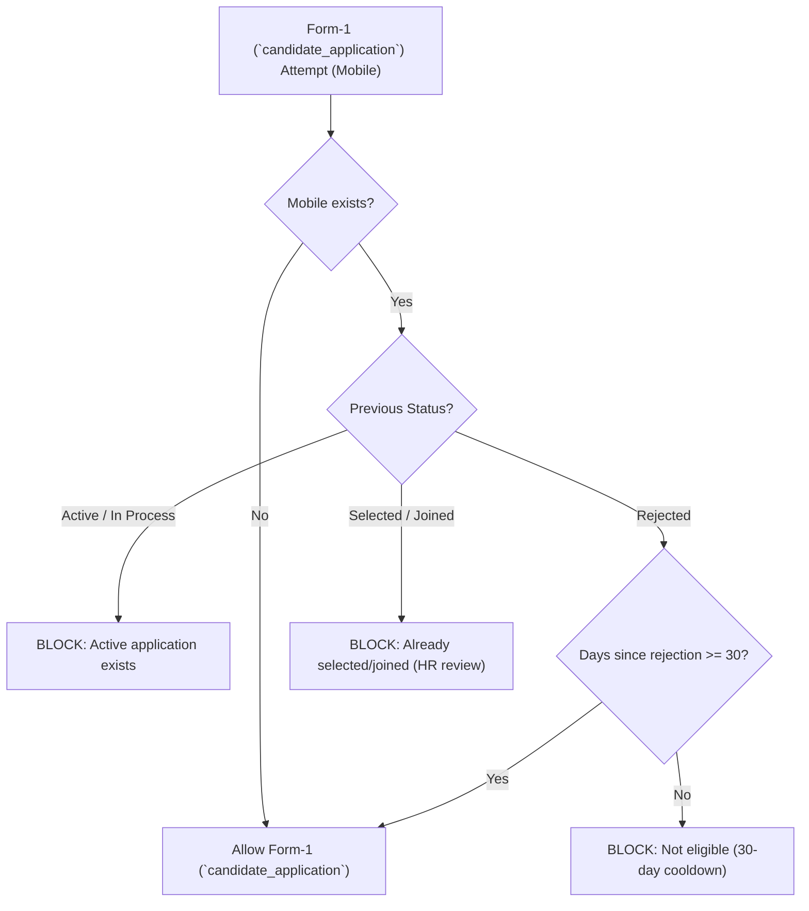

### Which date to use for the 30 days
Pick one method and keep it consistent:
- **Best:** `rejected_date` / `final_status_updated_at`
- If not available: use `form1_submitted_date` (less accurate)

---

## Mobile Number Logic (Identity Key)

### Mobile as primary key across modules
Once Form-1 (`candidate_application`) is submitted, the mobile number becomes:
- Dashboard lookup key
- WhatsApp target number
- Form-2 (`details_form`) login key
- Form-3 (`interview_question`) evaluation join key
- Selection join key
- Form-4 (`onboarding_form`) join key

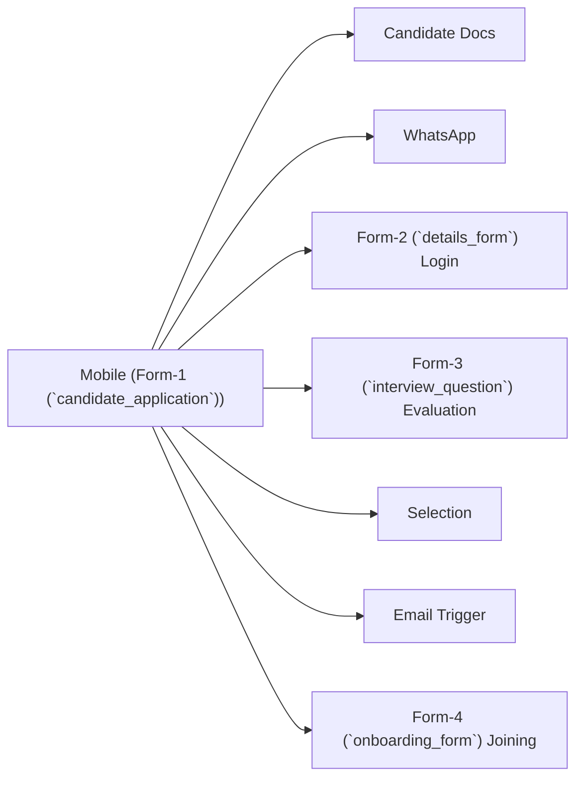

### If mobile is wrong in Form-1 (`candidate_application`) (real-world issue)
Impact:
- WhatsApp goes to wrong person
- Candidate cannot login Form-2 (`details_form`) using their real number

✅ Safe correction rule:
- If Form-2 (`details_form`) is **NOT submitted** → HR may correct Form-1 (`candidate_application`) mobile (recommended with audit note)
- If Form-2 (`details_form`) **IS submitted** → do not change mobile casually (admin-controlled change only)

---

## Duplicate Handling Logic

Duplicates are primarily checked by **same mobile**.

### Type 1 — Active duplicate
Same mobile already in active pipeline → **block**.

### Type 2 — Reapply after rejection
Same mobile rejected recently → **block until 30 days**, then allow.

### Type 3 — Selected/Joined
Same mobile already selected/joined → **block** or HR review.

---

## Status Pipeline Logic

Recommended statuses for clean tracking:
- **APPLIED** → Form-1 (`candidate_application`) submitted
- **DOCS_VERIFIED** → HR verified documents
- **INTERVIEW_SCHEDULED** → date/location saved in Form-1 (`candidate_application`)
- **WHATSAPP_SENT** → interview message sent
- **FORM2_SUBMITTED** → candidate completed Form-2 (`details_form`)
- **INTERVIEW_DONE** → interview completed
- **EVALUATED** → Form-3 (`interview_question`) submitted
- **SELECTED / REJECTED / HOLD**
- **EMAIL_SENT**
- **FORM4_SUBMITTED / JOINED**

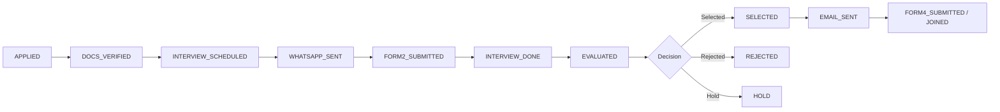

---

## End-to-End Workflow Summary

1. **Candidate fills Form-1 (`candidate_application`)**
2. HR opens **Dashboard**
3. HR checks **Candidate Documents** (Resume + Certificates)
4. HR opens **Form-1 (`candidate_application`)** (same candidate) and schedules **Interview location + date (+ time)**
5. HR sends **WhatsApp interview message**
6. Candidate visits office and scans **QR code**
7. Candidate logs in to **Form-2 (`details_form`)** using **same number as Form-1 (`candidate_application`)**
8. Candidate completes **Form-2 (`details_form`)**
9. HR conducts interview
10. HR fills **Form-3 (`interview_question`)** evaluation (role/designation questions)
11. HR marks **Selection** in Dashboard
12. Selected candidates receive **email**
13. Candidate visits again and fills **Form-4 (`onboarding_form`)** (joining)

---

## Workflow Diagrams

### A) Master process flow
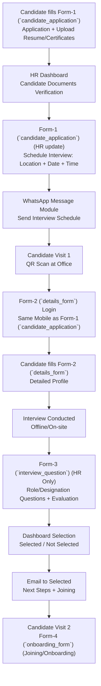

### B) Identity rule (mobile number as key)
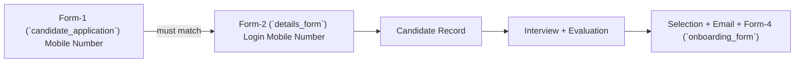

---

# Step 1 — Candidate fills Form-1 (`candidate_application`)

**Owner:** Candidate  
**Goal:** Create candidate record and attach documents.

## What candidate must do
1. Open **Form-1 (`candidate_application`)** link/page
2. Enter **mobile number** (must be correct)
3. Fill personal details
4. Select role/designation/branch (as per form)
5. Upload documents:
   - ✅ Resume (recommended mandatory)
   - ✅ Certificates (optional but preferred if relevant)
6. Submit Form-1 (`candidate_application`)

## Why this step matters
- Form-1 (`candidate_application`) creates the initial profile.
- The mobile number becomes the unique identifier for tracking.
- Documents uploaded here are what HR verifies before scheduling interview.

### Form-1 (`candidate_application`) micro-flow
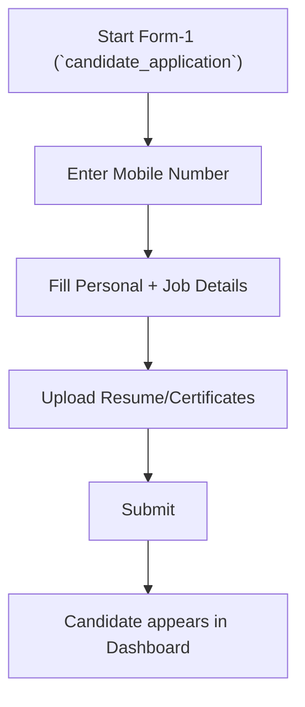

---

# Step 2 — HR Dashboard: Candidate Documents verification

**Owner:** HR  
**Goal:** Verify resume/certificates before interview schedule.

## What HR must do
1. Login to HR portal
2. Open **Dashboard**
3. Go to **Candidate Documents**
4. Search candidate by:
   - mobile number / name / application id
5. Open candidate documents:
   - Resume
   - Certificates (if present)

## What HR checks (recommended)
- Resume matches applied role
- Education meets minimum criteria
- Experience claims look realistic
- Certificates are relevant (basic sanity check)
- Name consistency across form + resume

✅ Outcome:
- **Eligible for interview scheduling** OR **Reject/hold before scheduling**

### Documents check flow
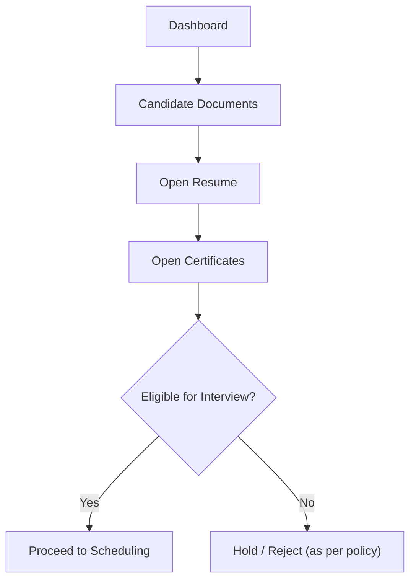

---

# Step 3 — HR schedules interview in Form-1 (`candidate_application`)

**Owner:** HR  
**Goal:** Add interview schedule details (location + date + time).

## What HR must do
1. From Dashboard, open candidate row/profile
2. Go to **Form-1 (`candidate_application`)** section (Form-1 (`candidate_application`) review/edit)
3. Fill:
   - **Interview Location**
   - **Interview Date**
   - **Interview Time** (if your UI supports)
4. Save/Submit

## Why scheduling happens here
- Form-1 (`candidate_application`) is the first record and already tied to the candidate identity.
- Scheduling here keeps all interview planning connected to the same candidate profile.

### Scheduling flow
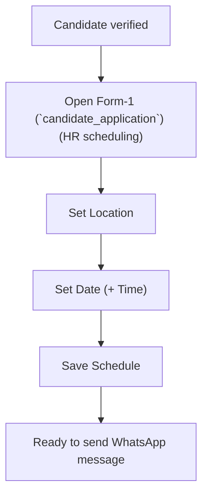

---

# Step 4 — HR sends WhatsApp interview message

**Owner:** HR  
**Goal:** Communicate schedule to candidate quickly and clearly.

## What HR must do
1. Open **WhatsApp Message** module/page
2. Find candidate (mobile/application ID)
3. Click **Send Interview Message**

## What message must contain
- Candidate name
- Interview date
- Interview time (if applicable)
- Interview location
- Instructions: “Scan QR at reception to fill Form-2 (`details_form`)”

### Suggested WhatsApp template
> Hi <Name>, your interview is scheduled on <Date> at <Time> at <Location>. Please come on time and scan the QR at reception to fill Form-2 (`details_form`).

### WhatsApp flow
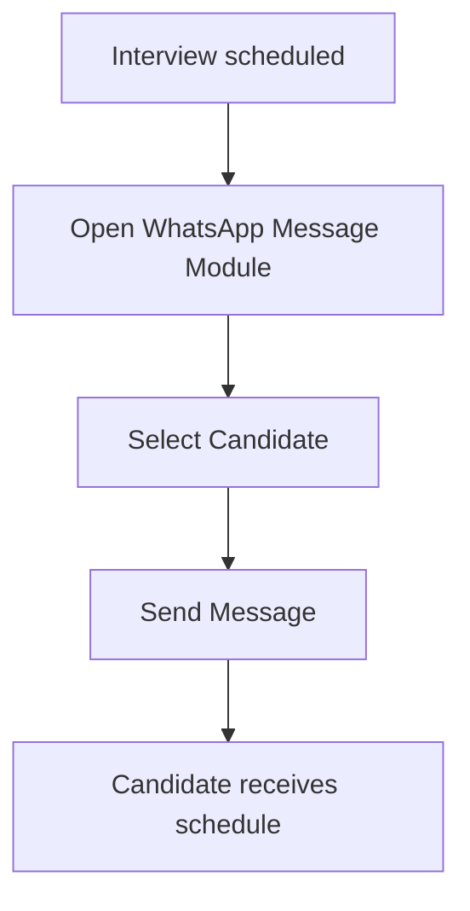

---

# Walk-in Form (Office Visit) — QR + Form-2 (`details_form`)

This section covers the **Walk‑in (Direct in Office) process** where the candidate **comes straight to the office**, scans a **QR code**, fills details, submits, and then HR conducts the interview using **Form‑3**.

> Implementation reference: `walkin_interview.py` is a **single Streamlit flow** that combines **Form‑1 + Form‑2**, reuses the same backend APIs, and finally marks `walk_in_status = "Done"` via `POST /walkin/mark-done`. 

---

## What “Walk‑in” means here (tell it like it is)
- Candidate **did not necessarily** apply from home first.
- Candidate is **already in the office** and will be interviewed **the same day**.
- The **QR is the entry gate**. No QR → no walk‑in form.

---

## What the QR should open (IMPORTANT)
For **direct walk‑in**, the QR **must open the Walk‑in Interview Application page**, not the old “Form‑2 login-only” page.

- ✅ Direct walk‑in QR → **Walk‑in Interview Application** (Form‑1 + Form‑2 together)
- ⚠️ Scheduled interview QR → **Form‑2 login-only** (used when Form‑1 is already done earlier)

---

## Walk‑in flow (Reception → Candidate → System → HR)
### 1) Reception / Admin
1. Show the **Walk‑in QR** to the candidate.
2. Ensure the page title shows **“Sampurna – Walk‑in Interview Application”**. 

### 2) Candidate (on phone)
The walk‑in form runs as **5 internal steps**:
1. **Mobile eligibility** check (enter mobile)   
2. **Form‑1 Basic** details
3. **Form‑1 Extra + Documents** (resume required)
4. **Form‑2 Screening/Fitment**
5. **Success screen** shows **Application ID**

### 3) System (backend sequence on Submit)
1. `POST /form1/submit` → returns `application_id`   
2. `POST /form1/upload-documents` → uploads resume/certs   
3. `POST /form2/submit` → saves Form‑2 linked by `application_id`   
4. `POST /walkin/mark-done` → sets `walk_in_status = "Done"`   

### 4) HR (what happens next)
- HR immediately conducts interview and records evaluation in **Form‑3 (`interview_question`)**.
- After Form‑3:
  - **Selected** → Dashboard selection → selection email → Form‑4 onboarding
  - **Rejected / Hold / Next round** → update status in Dashboard

---

## Data created/updated (high level)
| Stage | What gets created/updated |
|---|---|
| Walk‑in submit | `candidate_applications` row + `application_id` |
| Docs upload | Resume/Certificates stored and linked |
| Form‑2 submit | `details_form` row linked by `application_id` |
| Walk‑in mark done | `candidate_applications.walk_in_status = "Done"` |
| Form‑3 | `interview_question` evaluation saved |

---

# Step 5 — Candidate arrives: QR scan

**Owner:** Reception + Candidate  
**Goal:** Open the **Walk‑in Interview Application** from the QR.

## Process (direct walk‑in)
1. Candidate arrives at office (walk‑in interview)
2. Reception shows the **Walk‑in QR**
3. Candidate scans QR using phone camera
4. QR opens **Walk‑in Interview Application** (Form‑1 + Form‑2 in one flow) 
5. Candidate continues with **Mobile Eligibility** inside the app

## Output
- Candidate is inside the walk‑in form flow.

# Step 6 — Candidate logs in to Form-2 (`details_form`) with same number

**Owner:** Candidate  
**Goal:** In walk‑in mode, this step is effectively the **Mobile Eligibility + Identity** step.

## What happens in walk‑in mode
- Candidate enters mobile number
- System checks eligibility using:
  - `GET /form1/check-mobile-db/{mobile}` (fallback: `GET /form1/check-mobile/{mobile}`) 

## Output
- Eligible → candidate can continue to fill Form‑1 + Form‑2
- Not eligible → candidate cannot proceed (cooldown/eligibility rules apply)

# Step 7 — Candidate fills Form-2 (`details_form`)

**Owner:** Candidate  
**Goal:** In walk‑in mode, the candidate completes **Form‑1 + Form‑2 together** before interview.

## What the candidate completes (walk‑in)
- **Form‑1 (Basic + Extra + Documents)**: profile + role info + resume upload 
- **Form‑2 (Screening & Fitment)**: DOB/CTC/relocation/IDs etc. 

## What the system does on final submit
1. `POST /form1/submit` → gets `application_id` 
2. `POST /form1/upload-documents` → stores resume/certificates 
3. `POST /form2/submit` → saves `details_form` linked by `application_id` 
4. `POST /walkin/mark-done` → sets `walk_in_status = "Done"` 

## Output
- Success screen shows **Application ID** → share with HR for Form‑3 interview.

# Step 8 — HR conducts interview

**Owner:** HR/Interviewer  
**Goal:** Evaluate candidate suitability.

## Process
1. HR/interviewer reviews Form-1 (`candidate_application`) + Form-2 (`details_form`) details
2. Interview is conducted on-site (technical + HR rounds as per your policy)
3. Notes are recorded in **Form-3 (`interview_question`)**

---

# Step 9 — Form-3 (`interview_question`) (HR Only): Evaluation + Role questions

**Owner:** HR/Interviewer  
**Goal:** Structured evaluation using role/designation mapped questions.

## Steps
1. Open **Form-3 (`interview_question`)**
2. HR logs in with name/credentials
3. Search/select candidate by mobile number
4. System loads:
   - Designation/Role
   - Question set
5. Fill scores/remarks
6. Submit evaluation

## Why Form-3 (`interview_question`) matters
- Makes evaluation consistent
- Supports selection decisions with recorded proof

### Form-3 (`interview_question`) flow
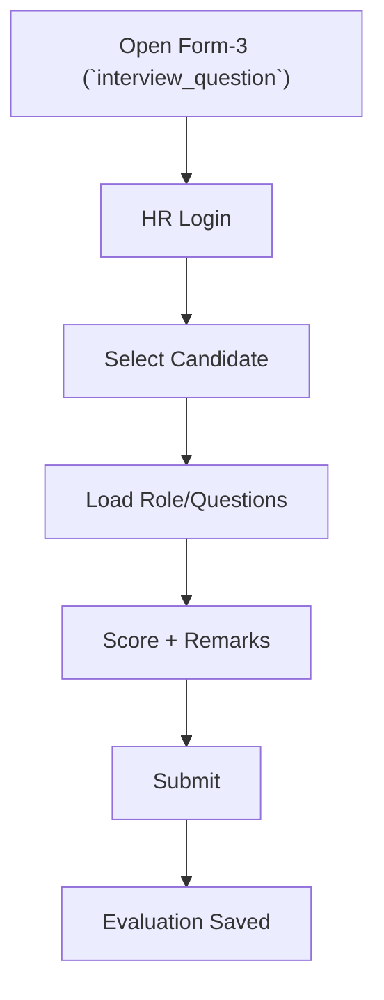

---

# Step 10 — Dashboard Selection: Selected / Not Selected

**Owner:** HR  
**Goal:** Final status update for candidate.

## Steps
1. Open Dashboard
2. Go to **Selection** section
3. Find candidate
4. Mark as:
   - ✅ Selected
   - ❌ Not Selected
   - (Optional) Hold/Pending (if supported)

### Selection flow
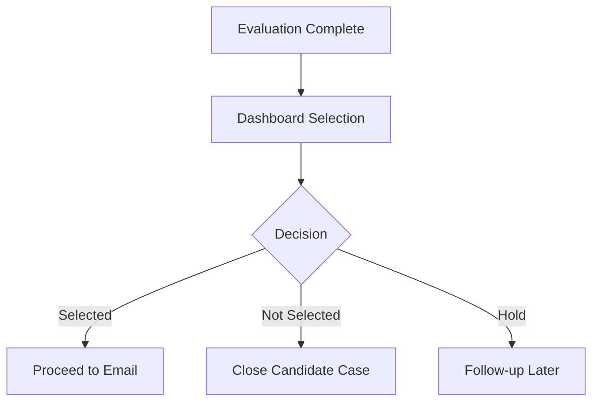

---

# Step 11 — Send email to Selected candidates

**Owner:** HR  
**Goal:** Confirm selection and communicate joining instructions.

## Email must include
- Congratulations/selection confirmation
- Job role/designation
- Reporting date & time
- Office address / location details
- Documents to bring
- Instruction to fill **Form-4 (`onboarding_form`)** on next visit

### Email flow
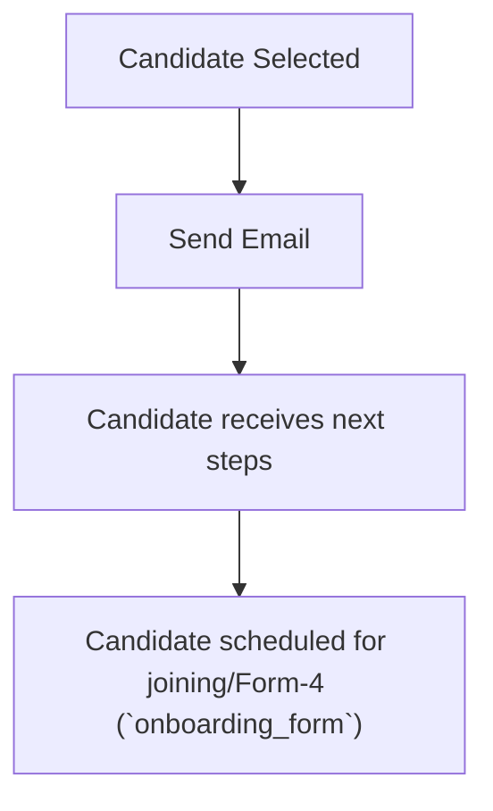

---

# Step 12 — Candidate Visit 2: Form-4 (`onboarding_form`) joining

**Owner:** Candidate  
**Goal:** Capture final onboarding/joining data.

## Steps
1. Candidate arrives for joining
2. Candidate opens Form-4 (`onboarding_form`) (link/QR)
3. Candidate fills Form-4 (`onboarding_form`):
   - Joining confirmation
   - Address validation
   - Bank details (if included)
   - Final declarations
4. Submit Form-4 (`onboarding_form`)

✅ Outcome:
- Onboarding process completed in system

### Form-4 (`onboarding_form`) flow
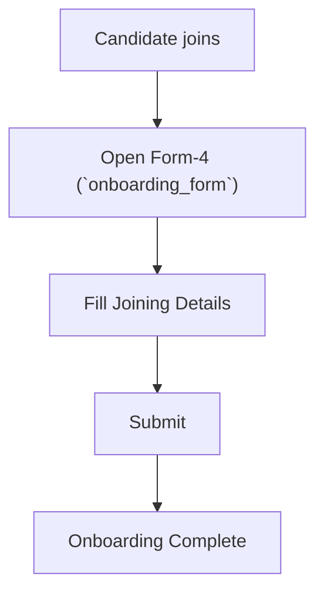

---

## Checklists (HR + Candidate)

### HR checklist (operational)
- [ ] Candidate Form-1 (`candidate_application`) submitted successfully
- [ ] Resume & certificates verified in Dashboard
- [ ] Interview schedule saved (location + date + time)
- [ ] WhatsApp message sent and delivered
- [ ] Candidate visited office and completed Form-2 (`details_form`)
- [ ] Interview conducted
- [ ] Form-3 (`interview_question`) evaluation submitted
- [ ] Selection marked in Dashboard
- [ ] Email sent to selected candidates
- [ ] Form-4 (`onboarding_form`) completed for joining candidates

### Candidate checklist
- [ ] Filled Form-1 (`candidate_application`) correctly (mobile number is correct)
- [ ] Uploaded resume (and certificates if available)
- [ ] Received WhatsApp interview message
- [ ] Came to office and scanned QR
- [ ] Logged in Form-2 (`details_form`) using same mobile as Form-1 (`candidate_application`)
- [ ] Filled Form-2 (`details_form`) and submitted
- [ ] Attended interview
- [ ] If selected, received email and came for joining
- [ ] Filled Form-4 (`onboarding_form`)

---

## Common Issues & Fixes

### 1) Form-2 (`details_form`) login not working
**Cause:** Mobile mismatch (Form-1 (`candidate_application`) vs Form-2 (`details_form`))

**Fix:**
- Candidate must use the same number
- If Form-1 (`candidate_application`) number is wrong, HR must correct Form-1 (`candidate_application`) record first

### 2) WhatsApp message not sending
**Causes:** Candidate not on WhatsApp / WhatsApp Web not logged in / automation session expired

**Fix:**
- Verify WhatsApp availability
- Log in WhatsApp Web
- Retry from WhatsApp Message module

### 3) Documents missing in Candidate Documents
**Cause:** Not uploaded or storage issue

**Fix:**
- Ask candidate to re-upload
- Use PDF/JPG/PNG
- Admin checks storage configuration/logs

### 4) Form-3 (`interview_question`) questions not loading
**Cause:** Role/Designation mapping not configured

**Fix:**
- Ensure designation is set correctly in Form-1 (`candidate_application`)
- Admin updates question set mapping

### 5) Candidate blocked from Form-1 (`candidate_application`) (30-day rule)
**Cause:** Recent rejection within last 30 days OR active application exists

**Fix:**
- Check last status and date
- If rejected: show eligible date after 30 days
- If active: continue the existing pipeline (do not create a new application)

---

## Operational Tips (Do’s & Don’ts)

### Do’s
- Do verify documents before scheduling
- Do keep interview schedule and WhatsApp message consistent
- Do enforce QR scan before Form-2 (`details_form`)
- Do submit Form-3 (`interview_question`) immediately after interview
- Do follow the 30-day rule after rejection (keeps pipeline clean)

### Don’ts
- Don’t allow Form-2 (`details_form`) with a different mobile number
- Don’t send WhatsApp message before saving schedule
- Don’t mark selection without Form-3 (`interview_question`) evaluation (best practice)
- Don’t allow Form-4 (`onboarding_form`) before candidate is selected
- Don’t allow repeated Form-1 (`candidate_application`) submissions within 30 days after rejection

---

© Sampurna Financial Services Pvt. Ltd. — Internal Use Only
